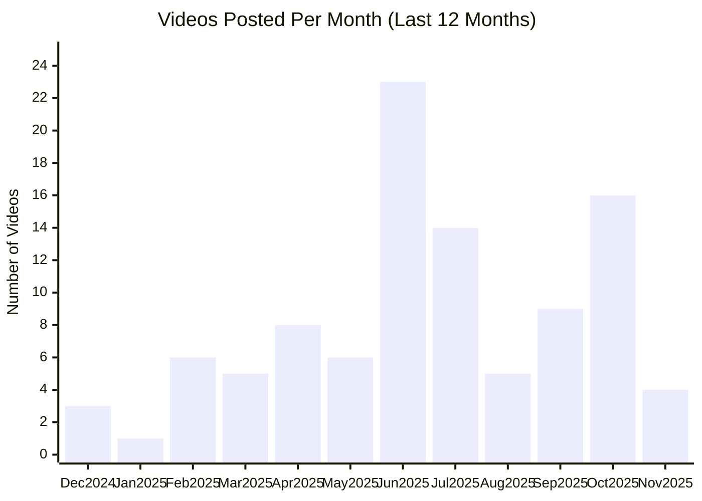

# Anthropic YouTube Channel

## Overview

- **Subscribers**: 307,000
- **Total Videos**: 136
- **Long-form Videos**: 102
- **Shorts**: 19
- **Posts in Last 2 Months**: 27

---

## Posting Frequency Over Time

---

## Long-form Videos

| Title | Summary | Views | Posted Date |
|-------|---------|-------|-------------|
| [Claude Code on the web](https://www.youtube.com/watch?v=s-avRazvmLg) | Claude Code on the web. Today, we're introducing Claude Code on the web, a new way to delegate coding tasks directly from your browser. Now in research preview, you can assign multiple coding tasks to Claude that run on Anthropic-managed cloud infrastructure, perfect for tackling bug backlogs, ro... | 1,131,042 | 10/20/2025 |
| [Introducing Claude Code](https://www.youtube.com/watch?v=AJpK3YTTKZ4) | Introducing Claude Code. We're launching Claude Code, our agentic coding tool, in a limited research preview. Claude Code lets developers delegate substantial engineering tasks to Claude directly from their terminal. | 733,839 | 02/24/2025 |
| [Mastering Claude Code in 30 minutes](https://www.youtube.com/watch?v=6eBSHbLKuN0) | Mastering Claude Code in 30 minutes. Learn advanced features, shortcuts, and workflows to get the most from Claude Code | 654,321 | 05/22/2025 |
| [Tips for building AI agents](https://www.youtube.com/watch?v=LP5OCa20Zpg) | Tips for building AI agents. Anthropic’s Barry Zhang (Applied AI), Erik Schluntz (Research), and Alex Albert (Claude Relations) discuss the potential of AI agents, common pitfalls to avoid, and how to prepare for the evolving landscape. | 534,950 | 02/13/2025 |
| [AI prompt engineering: A deep dive](https://www.youtube.com/watch?v=T9aRN5JkmL8) | AI prompt engineering: A deep dive. Some of Anthropic's prompt engineering experts—Amanda Askell (Alignment Finetuning), Alex Albert (Developer Relations), David Hershey (Applied AI), and Zack Witten (Prompt Engineering)—reflect on how prompt engineering has evolved, practical tips, and thoughts ... | 485,096 | 09/05/2024 |
| [Claude \| Computer use for automating operations](https://www.youtube.com/watch?v=ODaHJzOyVCQ) | Claude \| Computer use for automating operations. With the upgraded Claude 3.5 Sonnet, we’re introducing a new capability in beta: computer use. Developers can now direct Claude to use computers the way people do—by looking at a screen, moving a cursor, clicking, and typing text. | 340,673 | 10/22/2024 |
| [Claude Code best practices \| Code w/ Claude](https://www.youtube.com/watch?v=gv0WHhKelSE) | Claude Code best practices \| Code w/ Claude. Presented at Code w/ Claude by @anthropic-ai on May 22, 2025 in San Francisco, CA, USA. | 291,325 | 07/31/2025 |
| [Code with Claude Opening Keynote](https://www.youtube.com/watch?v=EvtPBaaykdo) | Code with Claude Opening Keynote. Content begins at 26:28. Hear directly from Anthropic executives and product leaders at Code with Claude. | 271,672 | 05/22/2025 |
| [Claude \| Computer use for coding](https://www.youtube.com/watch?v=vH2f7cjXjKI) | Claude \| Computer use for coding. With the upgraded Claude 3.5 Sonnet, we’re introducing a new capability in beta: computer use. Developers can now direct Claude to use computers the way people do—by looking at a screen, moving a cursor, clicking, and typing text. | 263,725 | 10/22/2024 |
| [Interpretability: Understanding how AI models think](https://www.youtube.com/watch?v=fGKNUvivvnc) | Interpretability: Understanding how AI models think. What's happening inside an AI model as it thinks? Why are AI models sycophantic, and why do they hallucinate? Are AI models just "glorified autocompletes", or is something more complicated going on? How do we even study these questions scientif... | 257,248 | 08/15/2025 |

*Top 10 videos by view count*

---

**Last Updated**: 11/16/2025
