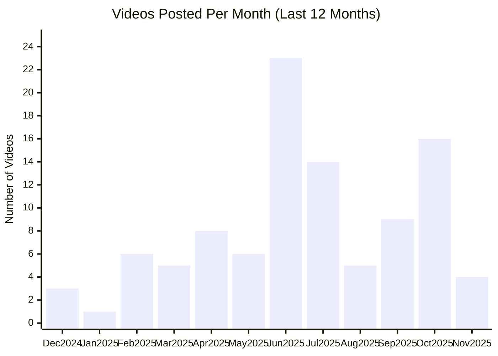

# Anthropic YouTube Channel

## Overview

- **Subscribers**: 307,000
- **Total Videos**: 136
- **Long-form Videos**: 102
- **Shorts**: 37
- **Posts in Last 2 Months**: 27

---

## Posting Frequency Over Time

---

## Long-form Videos

| Title | Summary | Views | Posted Date |
|-------|---------|-------|-------------|
| [Claude Code on the web](https://www.youtube.com/watch?v=s-avRazvmLg) | Claude Code on the web. Today, we're introducing Claude Code on the web, a new way to delegate coding tasks directly from your browser. Now in research preview, you can assign multiple coding tasks to Claude that run on Anthropic-managed cloud infrastructure, perfect for tackling bug backlogs, ro... | 1,131,042 | 10/20/2025 |
| [Introducing Claude Code](https://www.youtube.com/watch?v=AJpK3YTTKZ4) | Introducing Claude Code. We're launching Claude Code, our agentic coding tool, in a limited research preview. Claude Code lets developers delegate substantial engineering tasks to Claude directly from their terminal. | 733,839 | 02/24/2025 |
| [Mastering Claude Code in 30 minutes](https://www.youtube.com/watch?v=6eBSHbLKuN0) | Mastering Claude Code in 30 minutes. Learn advanced features, shortcuts, and workflows to get the most from Claude Code | 654,321 | 05/22/2025 |
| [Tips for building AI agents](https://www.youtube.com/watch?v=LP5OCa20Zpg) | Tips for building AI agents. Anthropic’s Barry Zhang (Applied AI), Erik Schluntz (Research), and Alex Albert (Claude Relations) discuss the potential of AI agents, common pitfalls to avoid, and how to prepare for the evolving landscape. | 534,950 | 02/13/2025 |
| [AI prompt engineering: A deep dive](https://www.youtube.com/watch?v=T9aRN5JkmL8) | AI prompt engineering: A deep dive. Some of Anthropic's prompt engineering experts—Amanda Askell (Alignment Finetuning), Alex Albert (Developer Relations), David Hershey (Applied AI), and Zack Witten (Prompt Engineering)—reflect on how prompt engineering has evolved, practical tips, and thoughts ... | 485,096 | 09/05/2024 |
| [Claude \| Computer use for automating operations](https://www.youtube.com/watch?v=ODaHJzOyVCQ) | Claude \| Computer use for automating operations. With the upgraded Claude 3.5 Sonnet, we’re introducing a new capability in beta: computer use. Developers can now direct Claude to use computers the way people do—by looking at a screen, moving a cursor, clicking, and typing text. | 340,673 | 10/22/2024 |
| [Claude Code best practices \| Code w/ Claude](https://www.youtube.com/watch?v=gv0WHhKelSE) | Claude Code best practices \| Code w/ Claude. Presented at Code w/ Claude by @anthropic-ai on May 22, 2025 in San Francisco, CA, USA. | 291,325 | 07/31/2025 |
| [Code with Claude Opening Keynote](https://www.youtube.com/watch?v=EvtPBaaykdo) | Code with Claude Opening Keynote. Content begins at 26:28. Hear directly from Anthropic executives and product leaders at Code with Claude. | 271,672 | 05/22/2025 |
| [Claude \| Computer use for coding](https://www.youtube.com/watch?v=vH2f7cjXjKI) | Claude \| Computer use for coding. With the upgraded Claude 3.5 Sonnet, we’re introducing a new capability in beta: computer use. Developers can now direct Claude to use computers the way people do—by looking at a screen, moving a cursor, clicking, and typing text. | 263,725 | 10/22/2024 |
| [Interpretability: Understanding how AI models think](https://www.youtube.com/watch?v=fGKNUvivvnc) | Interpretability: Understanding how AI models think. What's happening inside an AI model as it thinks? Why are AI models sycophantic, and why do they hallucinate? Are AI models just "glorified autocompletes", or is something more complicated going on? How do we even study these questions scientif... | 257,248 | 08/15/2025 |

*Top 10 videos by view count*

---

## Shorts

| Title | Summary | Views | Posted Date |
|-------|---------|-------|-------------|
| [A light refresh for Claude](https://www.youtube.com/watch?v=evqEABDed5U) | A light refresh for Claude. We've done some spring cleaning. The Claude interface is now more refined, thanks to your feedback. We’ve also added new suggested prompts to inspire more conversations, right from the start. | 36,009,000 | 03/28/2025 |
| [Research and a new Google Workspace integration](https://www.youtube.com/watch?v=HcJXobu_hMY) | Research and a new Google Workspace integration. Claude now brings together information from your work and the web. | 10,224,231 | 04/15/2025 |
| [Turn ideas into interactive artifacts](https://www.youtube.com/watch?v=iSn77jvjojA) | Turn ideas into interactive artifacts. Introducing a dedicated space to view artifacts in the Claude app, and the ability to embed AI capabilities directly into your creations—transforming artifacts into interactive, AI-powered apps. | 123,104 | 06/26/2025 |
| [Claude Code turns your ideas into working prototypes](https://www.youtube.com/watch?v=RCKo7OdjrCw) | Claude Code turns your ideas into working prototypes. Claude Code autonomously handles complex development tasks, turning your ideas into working prototypes. | 101,713 | 06/17/2025 |
| [Build a Claude-powered app](https://www.youtube.com/watch?v=PBxwtabGltc) | Build a Claude-powered app. Artifacts turn anyone into an app creator—no coding needed. Just tell Claude your idea to instantly create shareable apps, tools, and games. Now developers can iterate faster on their AI apps without worrying about the complexity and cost of scaling for a growing audie... | 93,046 | 06/26/2025 |
| [Claude 3.7 Sonnet with extended thinking](https://www.youtube.com/watch?v=t3nnDXa81Hs) | Claude 3.7 Sonnet with extended thinking. Introducing Claude 3.7 Sonnet: our most intelligent model to date. It's a hybrid reasoning model, producing near-instant responses or extended, step-by-step thinking. | 87,764 | 02/24/2025 |
| [Claude can create and edit files](https://www.youtube.com/watch?v=EV89Ws8Ui9Y) | Claude can create and edit files. Now Claude can create and work directly with your files, eliminating hours of manual busywork. This doesn't just save time; it brings Claude's analytical power straight into documents, spreadsheets, presentations, and PDFs. | 78,416 | 09/09/2025 |
| [Research Preview: Claude for Chrome](https://www.youtube.com/watch?v=mCj4kx_P2Ak) | Research Preview: Claude for Chrome. Research Preview: Claude for Chrome | 73,450 | 08/27/2025 |
| [Claude now has memory](https://www.youtube.com/watch?v=PupmfSttxlc) | Claude now has memory. Claude can now remember how you work across conversations on web, desktop, and mobile apps. No more re-explaining context or hunting through old chats—just pick up right where you left off. | 68,898 | 10/23/2025 |
| [Claude Code + GitHub Actions](https://www.youtube.com/watch?v=L_WFEgry87M) | Claude Code + GitHub Actions. You can now run Claude Code directly from your GitHub PRs, turning it into a virtual teammate that can respond to reviewer feedback, fix CI errors, and modify code. This is powered by GitHub Actions and built on the publicly available Claude Code SDK. | 55,602 | 05/22/2025 |
| [Introducing Claude Haiku 4.5](https://www.youtube.com/watch?v=ccQSHQ3VGIc) | Introducing Claude Haiku 4.5. What was recently frontier is now cheaper and faster. | 50,114 | 10/15/2025 |
| [Creating custom Skills with Claude](https://www.youtube.com/watch?v=kS1MJFZWMq4) | Creating custom Skills with Claude. The skill-creator Skill guides you through building any custom capability you can imagine. In this example, watch Claude ask clarifying questions and build a complete image editing skill—but you can create Skills for any workflow. No manual file editing required. | 47,731 | 10/16/2025 |
| [Discover tools that work with Claude](https://www.youtube.com/watch?v=4PtGWgEO0ME) | Discover tools that work with Claude. We launched a new directory of tools that connect directly to Claude. Connect Claude to Notion, Canva, Figma, Stripe, and more in one click. Claude can see your projects, understand your deadlines, and work directly in your tools. | 46,277 | 07/14/2025 |
| [Introducing Claude for Education](https://www.youtube.com/watch?v=MIzq6LCMTtA) | Introducing Claude for Education. We're partnering with universities to bring AI to higher education, alongside a new learning mode for students. Claude for Education is now available for all Pro users with an .edu email. | 34,102 | 04/07/2025 |
| [AI Prompt Engineering 101: Explained](https://www.youtube.com/watch?v=FbAxP2-Jfps) | AI Prompt Engineering 101: Explained. Anthropic's Zack Witten explains what prompt engineering is. | 31,195 | 09/13/2024 |
| [Shareable Projects in Claude](https://www.youtube.com/watch?v=nbG2DO6Xsek) | Shareable Projects in Claude. You can now organize chats with Claude into shareable Projects. | 30,810 | 06/25/2024 |
| [Pick up where you left off with Claude](https://www.youtube.com/watch?v=UdoY2l5TZaA) | Pick up where you left off with Claude. Never lose track of your work again. Claude now remembers your past conversations, so you can seamlessly continue projects, reference previous discussions, and build on your ideas without starting from scratch every time. | 29,369 | 08/11/2025 |
| [Claude Connectors](https://www.youtube.com/watch?v=lUF_bjBSgXM) | Claude Connectors. Claude now connects to your favorite tools with one click. Browse and connect to Canva, Figma, Notion, Stripe, and more. | 27,589 | 07/15/2025 |
| [Claude streamlines task management across your favorite tools](https://www.youtube.com/watch?v=k6sx_ZmthCw) | Claude streamlines task management across your favorite tools. Claude turns a product requirements doc into into structured Asana tasks, automatically assigning them to the right team members and setting deadlines. | 16,365 | 06/17/2025 |
| [The creative process with AI](https://www.youtube.com/watch?v=liimqYe09U4) | The creative process with AI. Designer Ryan Mather on the creative process with AI. | 15,643 | 06/13/2025 |

*Top 20 shorts by view count*

---

**Last Updated**: 11/16/2025
