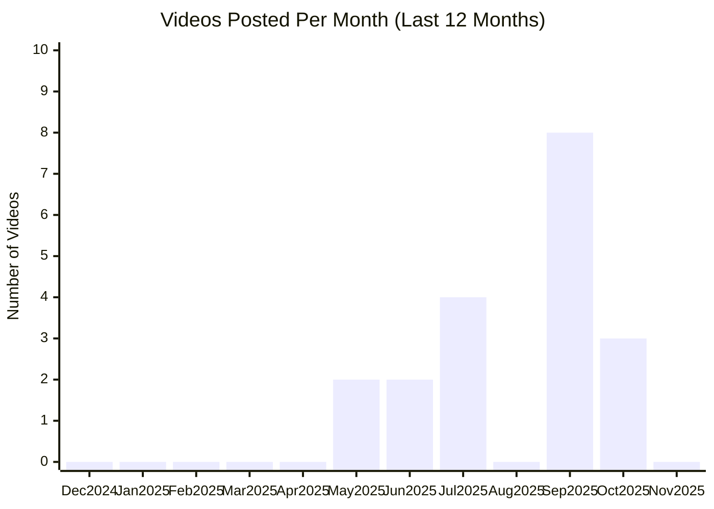

# Cursor AI YouTube Channel

## Overview

- **Subscribers**: 37,700
- **Total Videos**: 19
- **Long-form Videos**: 19
- **Shorts**: 0
- **Posts in Last 2 Months**: 11

---

## Posting Frequency Over Time

---

## Long-form Videos

| Title | Summary | Views | Posted Date |
|-------|---------|-------|-------------|
| [Introducing Cursor 2.0](https://www.youtube.com/watch?v=An8IM-kPyms) | Introducing Cursor 2.0. Introducing Cursor 2.0 | 4,324,451 | 10/29/2025 |
| [Cursor Agent: 10 Pro Tips!](https://www.youtube.com/watch?v=WVeYLlKOWc0) | Cursor Agent: 10 Pro Tips!. Cursor Agent: 10 Pro Tips! | 696,559 | 10/11/2025 |
| [Meet Cursor 1.0](https://www.youtube.com/watch?v=s5kX-UHgMLo) | Meet Cursor 1.0. Cursor 1.0 is out now! BugBot automatically reviews your PRs and catches bugs, Memories learns from your codebase, and Background Agent handles multiple coding tasks simultaneously. Plus: Jupyter notebook support, one-click MCP setup, and enhanced chat with visualizations. | 171,755 | 06/04/2025 |
| [Patrick Collison on programming languages, AI, and Stripe's biggest engineering decisions](https://www.youtube.com/watch?v=motX94ztOzo) | Patrick Collison on programming languages, AI, and Stripe's biggest engineering decisions. Michael Truell (CEO of Cursor) sits down with Patrick Collison (CEO of Stripe) to discuss programming languages, the role of AI in programming, and building long-lasting software. | 104,459 | 07/15/2025 |
| [Cursor's largest update yet](https://www.youtube.com/watch?v=mtfOZ6PoGsA) | Cursor's largest update yet. Cursor 0.50 is here! New Tab model handles cross-file refactors, Background Agent tackles multiple tasks simultaneously, and Max Mode now available for all top models. Includes @folders for codebase context, redesigned Inline Edit, faster agent file edits, multi-root ... | 102,166 | 05/21/2025 |
| [Cursor on Web and Mobile](https://www.youtube.com/watch?v=hHTKtrSO6os) | Cursor on Web and Mobile. Work with a powerful coding assistant anywhere with the Cursor Agent on web and mobile. | 99,396 | 06/30/2025 |
| [Using the Figma MCP server with Cursor](https://www.youtube.com/watch?v=ftQ22bNHyS4) | Using the Figma MCP server with Cursor. Learn how to convert your Figma designs into code with Cursor and the new Figma MCP. | 89,657 | 09/26/2025 |
| [Introducing Plan Mode](https://www.youtube.com/watch?v=WInPBmCK3l4) | Introducing Plan Mode. Cursor can now write detailed plans before starting complex tasks. | 81,935 | 10/07/2025 |
| [Our designer built an operating system with Cursor](https://www.youtube.com/watch?v=TQhv6Wol6Ns) | Our designer built an operating system with Cursor. Ryo Lu, Cursor's Head of Design, on his personal operating system, ryOS, and what it means to be a builder with AI. | 52,211 | 07/30/2025 |
| [Training superhuman coding models at Cursor](https://www.youtube.com/watch?v=sLaxGAL_Pl0) | Training superhuman coding models at Cursor. A conversation on the optimal reward for coding agents, infinite context models, and real-time RL. | 43,861 | 05/29/2025 |

*Top 10 videos by view count*

---

## Shorts

| Title | Summary | Views | Posted Date |
|-------|---------|-------|-------------|
| *No shorts found* | - | - | - |

*Top 20 shorts by view count*

---

**Last Updated**: 11/16/2025
