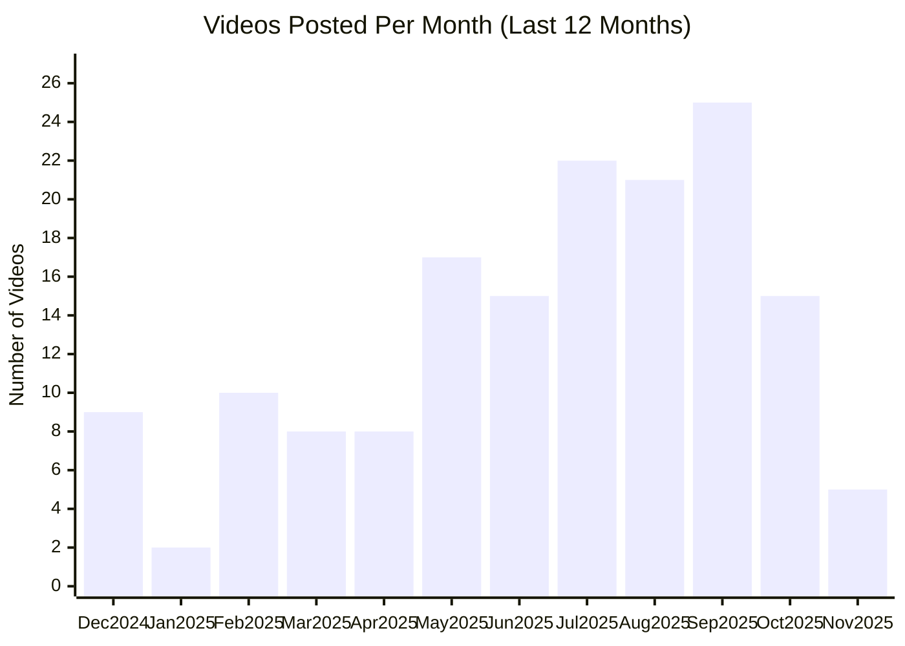

# ElevenLabs YouTube Channel

## Overview

- **Subscribers**: 95,500
- **Total Videos**: 201
- **Long-form Videos**: 143
- **Shorts**: 59
- **Posts in Last 2 Months**: 31

---

## Posting Frequency Over Time

---

## Long-form Videos

| Title | Summary | Views | Posted Date |
|-------|---------|-------|-------------|
| [Introducing ElevenLabs Conversational Agents](https://www.youtube.com/watch?v=v-EYzZCLF48) | Introducing ElevenLabs Conversational Agents. Introducing ElevenLabs Conversational Agents | 8,268,271 | 12/03/2024 |
| [Introducing ElevenLabs Conversational AI 2.0](https://www.youtube.com/watch?v=TlclS4wLWgY) | Introducing ElevenLabs Conversational AI 2.0. Introducing ElevenLabs Conversational AI 2.0 — a significant update designed to let you create more natural and capable voice agents. | 5,234,053 | 05/30/2025 |
| [Introducing Studio 3.0 — The Best AI Audio Models in One Editor](https://www.youtube.com/watch?v=ZZSROGCVg9M) | Introducing Studio 3.0 — The Best AI Audio Models in One Editor. Introducing Studio 3.0 — the most advanced AI audio editor, now with full video integration. | 4,395,184 | 09/17/2025 |
| [Conversational AI Voice Agents that can issue refunds](https://www.youtube.com/watch?v=0KKuk2HNATQ) | Conversational AI Voice Agents that can issue refunds. Built with ElevenLabs Conversational AI: https://elevenlabs.io?utm_source=youtube&utm_medium=organic&utm_campaign=not_set&utm_content=conversational_ai_voice_agents_that_can_issue_refunds | 2,160,735 | 01/13/2025 |
| [How to Use AI Sound Effects – ElevenLabs SFX v2 Walkthrough](https://www.youtube.com/watch?v=iyHypKlscV0) | How to Use AI Sound Effects – ElevenLabs SFX v2 Walkthrough. I Sound Effects just got a major upgrade with ElevenLabs SFX v2. | 2,085,304 | 09/05/2025 |
| [Create Viral Hooks with Nano Banana and Veo 3 (AI workflow)](https://www.youtube.com/watch?v=jtQiCJXOvdg) | Create Viral Hooks with Nano Banana and Veo 3 (AI workflow). Create viral video hooks with Google’s Nano Banana, Veo 3, and ElevenLabs. | 696,455 | 09/03/2025 |
| [Introducing: Projects](https://www.youtube.com/watch?v=DQWX21gmGEw) | Introducing: Projects. Projects lets you generate an entire audiobook at the click of a button. | 212,066 | 09/19/2023 |
| [AI Narrates The Great Gatsby](https://www.youtube.com/watch?v=qRPTwPuZLjk) | AI Narrates The Great Gatsby. The voice you hear was artificially generated using speech synthesis software developed by ElevenLabs. The input was pure text and no corrections were made. | 171,814 | 01/27/2023 |
| [Create Videos with Nano Banana, Runway, ElevenLabs (Realistic AI Video)](https://www.youtube.com/watch?v=S4pjkkcBXy8) | Create Videos with Nano Banana, Runway, ElevenLabs (Realistic AI Video). Create videos with Google’s Nano Banana image model, Runway, and ElevenLabs. | 118,959 | 08/28/2025 |
| [Introducing 11ai](https://www.youtube.com/watch?v=HOg8jPLTwLI) | Introducing 11ai. Introducing 11ai - the AI personal assistant that's voice-first and supports MCP. | 103,670 | 06/23/2025 |

*Top 10 videos by view count*

---

## Shorts

| Title | Summary | Views | Posted Date |
|-------|---------|-------|-------------|
| [ElevenLabs Voice Design](https://www.youtube.com/watch?v=miVQXMZARuQ) | ElevenLabs Voice Design. ElevenLabs Voice Design | 3,847,290 | 10/23/2024 |
| [Professional Voice Cloning Demo \| ElevenLabs](https://www.youtube.com/watch?v=AyQqhXU6DrM) | Professional Voice Cloning Demo \| ElevenLabs. Professional Voice Cloning allows you to create a high-quality digital replica of your voice that can seamlessly converse in multiple languages. | 2,684,943 | 08/08/2023 |
| [Announcing The Chroma Awards](https://www.youtube.com/watch?v=AlaHUK63DSs) | Announcing The Chroma Awards. ElevenLabs is proud to announce the Chroma Awards - The “Olympics” of AI Film, Music, and Games. | 2,375,758 | 08/11/2025 |
| [Automatically Generate Music for Your Videos - Video to Music AI](https://www.youtube.com/watch?v=iSrjS7jzREk) | Automatically Generate Music for Your Videos - Video to Music AI. Learn how to create unique soundtracks for your videos in seconds. | 1,386,488 | 08/17/2025 |
| [AI Voice Isolator for Background Noise Removal - real-world ElevenLabs demo](https://www.youtube.com/watch?v=0XilJotp0O4) | AI Voice Isolator for Background Noise Removal - real-world ElevenLabs demo. Remove background noise from your videos for free with our AI-powered Voice Isolator: https://elevenlabs.io/voice-isolator/?utm_source=youtube&utm_medium=organic&utm_campaign=evergreen_tutorials&utm_content=voice_isolato... | 915,884 | 07/21/2025 |
| [Create the perfect AI voices.](https://www.youtube.com/watch?v=S8Pcf3DpgEc) | Create the perfect AI voices.. In this short tutorial, you'll learn how to create custom voices and lip sync them with your AI characters. | 594,930 | 07/04/2025 |
| [The Biggest AI Contest is Here — Join the Chroma Awards](https://www.youtube.com/watch?v=Hvzllm0_qRo) | The Biggest AI Contest is Here — Join the Chroma Awards. The Biggest AI Contest is Here — Join the Chroma Awards | 456,933 | 09/19/2025 |
| [Sound Effects are Coming Soon to ElevenLabs](https://www.youtube.com/watch?v=VDaZ9gTx7A8) | Sound Effects are Coming Soon to ElevenLabs. We were blown away by the Sora announcement but felt it was missing something... | 72,903 | 02/19/2024 |
| [Meet Flash](https://www.youtube.com/watch?v=0YmHnkTVkFA) | Meet Flash. Meet Flash. Our newest model that generates speech in 75ms + application & network latency. | 67,721 | 12/18/2024 |
| [Create Nano Banana Videos with Runway & ElevenLabs](https://www.youtube.com/watch?v=iieYcIzBNnU) | Create Nano Banana Videos with Runway & ElevenLabs. See how Google's Nano Banana, Runway, and ElevenLabs can be combined to create impressive AI videos. This allows for transformations and edits while maintaining the original surroundings and context. | 59,399 | 08/29/2025 |
| [Meet Scribe](https://www.youtube.com/watch?v=K-48RXyuRaY) | Meet Scribe. Introducing Scribe — the most accurate Speech to Text model. | 50,584 | 02/26/2025 |
| [Transform your Speech with ElevenLabs Voice Changer](https://www.youtube.com/watch?v=Z4AeU2flEWs) | Transform your Speech with ElevenLabs Voice Changer. Record yourself speaking, then transform your speech and all its unique nuances into thousands of different characters. | 47,280 | 02/11/2025 |
| [ElevenLabs Dubbing Studio](https://www.youtube.com/watch?v=-5KlmJmdcas) | ElevenLabs Dubbing Studio. ElevenLabs Dubbing Studio | 36,292 | 01/23/2024 |
| [Introducing Voice Design v3: Create Expressive AI Voices from Text](https://www.youtube.com/watch?v=_396fziGvrQ) | Introducing Voice Design v3: Create Expressive AI Voices from Text. Introducing Voice Design v3: Create Expressive AI Voices from Text | 35,062 | 06/25/2025 |
| [ElevenLabs Speech to Speech](https://www.youtube.com/watch?v=FK8sgB-58q0) | ElevenLabs Speech to Speech. Speech to Speech is now available in 29 languages. | 23,904 | 02/13/2024 |
| [Introducing: Voice Library \| ElevenLabs](https://www.youtube.com/watch?v=WGwEZIHfRss) | Introducing: Voice Library \| ElevenLabs. Voice Library is a community space for generating, sharing, and exploring a virtually infinite range of voices. Leveraging our proprietary Voice Design tool, Voice Library brings together a global collection of vocal styles for countless applications. | 22,092 | 06/23/2023 |
| [ElevenLabs Iconic Voices - Judy Garland](https://www.youtube.com/watch?v=Zo5-rhYOlNk) | ElevenLabs Iconic Voices - Judy Garland. ElevenLabs Iconic Voices - Judy Garland | 21,567 | 07/02/2024 |
| [ElevenReader App by ElevenLabs](https://www.youtube.com/watch?v=d-2ktTBv_KY) | ElevenReader App by ElevenLabs. Introducing the ElevenReader App. Listen to any article, PDF, ePub, or any text on the go with the highest quality AI voices. | 20,920 | 06/25/2024 |
| [Use HeyGen Avatar IV to Make AI Movie Characters](https://www.youtube.com/watch?v=HbJtOE9mx2I) | Use HeyGen Avatar IV to Make AI Movie Characters. HeyGen just launched Avatar IV, and it’s perfect for creating characters in AI films, animated content, or anonymous YouTube videos. | 20,342 | 05/14/2025 |
| [ElevenLabs Reader App - Android](https://www.youtube.com/watch?v=ndr5KWpniro) | ElevenLabs Reader App - Android. The ElevenLabs Reader App is now on Android. Choose from hundreds of high quality AI voices to narrate any article, PDF, ePub on the go. | 13,256 | 07/22/2024 |

*Top 20 shorts by view count*

---

**Last Updated**: 11/16/2025
