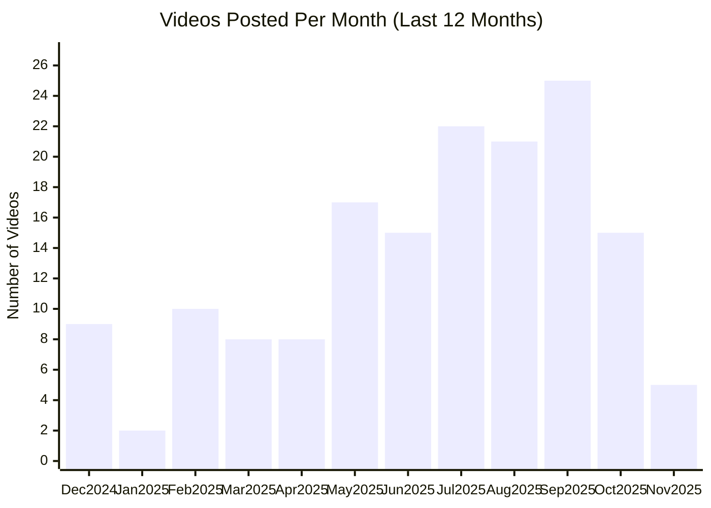

# ElevenLabs YouTube Channel

## Overview

- **Subscribers**: 95,500
- **Total Videos**: 201
- **Long-form Videos**: 143
- **Shorts**: 32
- **Posts in Last 2 Months**: 31

---

## Posting Frequency Over Time

---

## Long-form Videos

| Title | Summary | Views | Posted Date |
|-------|---------|-------|-------------|
| [Introducing ElevenLabs Conversational Agents](https://www.youtube.com/watch?v=v-EYzZCLF48) | Introducing ElevenLabs Conversational Agents. Introducing ElevenLabs Conversational Agents | 8,268,271 | 12/03/2024 |
| [Introducing ElevenLabs Conversational AI 2.0](https://www.youtube.com/watch?v=TlclS4wLWgY) | Introducing ElevenLabs Conversational AI 2.0. Introducing ElevenLabs Conversational AI 2.0 — a significant update designed to let you create more natural and capable voice agents. | 5,234,053 | 05/30/2025 |
| [Introducing Studio 3.0 — The Best AI Audio Models in One Editor](https://www.youtube.com/watch?v=ZZSROGCVg9M) | Introducing Studio 3.0 — The Best AI Audio Models in One Editor. Introducing Studio 3.0 — the most advanced AI audio editor, now with full video integration. | 4,395,184 | 09/17/2025 |
| [Conversational AI Voice Agents that can issue refunds](https://www.youtube.com/watch?v=0KKuk2HNATQ) | Conversational AI Voice Agents that can issue refunds. Built with ElevenLabs Conversational AI: https://elevenlabs.io?utm_source=youtube&utm_medium=organic&utm_campaign=not_set&utm_content=conversational_ai_voice_agents_that_can_issue_refunds | 2,160,735 | 01/13/2025 |
| [How to Use AI Sound Effects – ElevenLabs SFX v2 Walkthrough](https://www.youtube.com/watch?v=iyHypKlscV0) | How to Use AI Sound Effects – ElevenLabs SFX v2 Walkthrough. I Sound Effects just got a major upgrade with ElevenLabs SFX v2. | 2,085,304 | 09/05/2025 |
| [Create Viral Hooks with Nano Banana and Veo 3 (AI workflow)](https://www.youtube.com/watch?v=jtQiCJXOvdg) | Create Viral Hooks with Nano Banana and Veo 3 (AI workflow). Create viral video hooks with Google’s Nano Banana, Veo 3, and ElevenLabs. | 696,455 | 09/03/2025 |
| [Introducing: Projects](https://www.youtube.com/watch?v=DQWX21gmGEw) | Introducing: Projects. Projects lets you generate an entire audiobook at the click of a button. | 212,066 | 09/19/2023 |
| [AI Narrates The Great Gatsby](https://www.youtube.com/watch?v=qRPTwPuZLjk) | AI Narrates The Great Gatsby. The voice you hear was artificially generated using speech synthesis software developed by ElevenLabs. The input was pure text and no corrections were made. | 171,814 | 01/27/2023 |
| [Create Videos with Nano Banana, Runway, ElevenLabs (Realistic AI Video)](https://www.youtube.com/watch?v=S4pjkkcBXy8) | Create Videos with Nano Banana, Runway, ElevenLabs (Realistic AI Video). Create videos with Google’s Nano Banana image model, Runway, and ElevenLabs. | 118,959 | 08/28/2025 |
| [Introducing 11ai](https://www.youtube.com/watch?v=HOg8jPLTwLI) | Introducing 11ai. Introducing 11ai - the AI personal assistant that's voice-first and supports MCP. | 103,670 | 06/23/2025 |

*Top 10 videos by view count*

---

**Last Updated**: 11/16/2025
