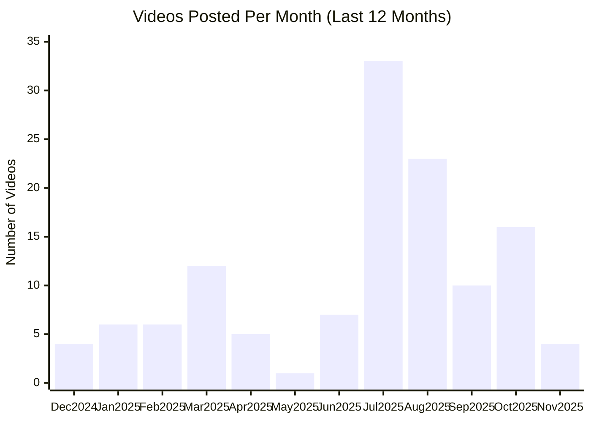

# Lovable YouTube Channel

## Overview

- **Subscribers**: 46,700
- **Total Videos**: 130
- **Long-form Videos**: 92
- **Shorts**: 60
- **Posts in Last 2 Months**: 25

---

## Posting Frequency Over Time

---

## Long-form Videos

| Title | Summary | Views | Posted Date |
|-------|---------|-------|-------------|
| [Lovable – An AI Full-Stack Engineer](https://www.youtube.com/watch?v=xhW9up0Gi2E) | Lovable – An AI Full-Stack Engineer. Lovable lets you take an idea of an app or website into reality just by prompting. | 4,323,530 | 11/21/2024 |
| [Journalist With Billion Dollar App Idea 🤑 #ai #tech #lovable #streetinterview #startup](https://www.youtube.com/watch?v=0UqCPWuwHb8) | Journalist With Billion Dollar App Idea 🤑 #ai #tech #lovable #streetinterview #startup. Journalist With Billion Dollar App Idea 🤑 #ai #tech #lovable #streetinterview #startup | 3,745,299 | 09/03/2025 |
| [Lovable 2.0 is here. Multiplayer vibe coding. Smarter & more secure.](https://www.youtube.com/watch?v=xDwR1_vrIg8) | Lovable 2.0 is here. Multiplayer vibe coding. Smarter & more secure.. Lovable lets build you apps and websites by chatting with AI. | 1,572,600 | 04/24/2025 |
| [How He Built A $1.2M Lovable Agency #ai #tech #appdevelopment](https://www.youtube.com/watch?v=D21XQK1luWs) | How He Built A $1.2M Lovable Agency #ai #tech #appdevelopment. How He Built A $1.2M Lovable Agency #ai #tech #appdevelopment | 472,439 | 09/19/2025 |
| [Introducing Lovable Cloud & AI](https://www.youtube.com/watch?v=kcOrTOT7Kko) | Introducing Lovable Cloud & AI. Anyone can now build apps with complex AI and backend functionality, just by prompting. | 402,854 | 09/29/2025 |
| [Introducing our Shopify Integration](https://www.youtube.com/watch?v=mF3VgbuoK8M) | Introducing our Shopify Integration. Now you can sell products online with lovable seamlessly and safely using our new Shopify integration. | 301,696 | 10/21/2025 |
| [He couldn't believe it 😂 #ai #lovable](https://www.youtube.com/watch?v=KIWvYTNYDYo) | He couldn't believe it 😂 #ai #lovable. 🚀 Try Lovable now: https://lovable.dev/?utm_source=youtube-organic&utm_campaign=streetinterview&utm_content=streetinterview | 295,165 | 10/25/2025 |
| [We 10x his business efficiency in 1min](https://www.youtube.com/watch?v=y2PQBhpvS9E) | We 10x his business efficiency in 1min. We 10x his business efficiency in 1min | 176,515 | 10/03/2025 |
| [Building a Luma Clone with Supabase & Lovable – LIVE Demo!](https://www.youtube.com/watch?v=-sSOyO0FiPE) | Building a Luma Clone with Supabase & Lovable – LIVE Demo!. 🚀 Can we build an event management platform in just 1 hour? Let’s find out! Join us for this hands-on session featuring @dshukertjr  from @Supabase , where we attempt to build a Luma-style event platform using Lovable and Supabase – live! | 136,921 | 03/06/2025 |
| [Build an AI-Powered Web App in 20 Minutes—No Code Required!](https://www.youtube.com/watch?v=gqsZGxuymTk) | Build an AI-Powered Web App in 20 Minutes—No Code Required!. 🚀 Build AI-powered web apps in just 20 minutes—NO coding required! In this tutorial, we’ll show you how to use Lovable, an AI-enhanced no-code builder, to create a full-stack journaling app without writing a single line of code! | 118,104 | 01/07/2025 |

*Top 10 videos by view count*

---

## Shorts

| Title | Summary | Views | Posted Date |
|-------|---------|-------|-------------|
| [This Technic Is 4000 Years Old 🕰️](https://www.youtube.com/watch?v=l_drGyejcdg) | This Technic Is 4000 Years Old 🕰️. This Technic Is 4000 Years Old 🕰️ | 9,558,852 | 10/21/2025 |
| [☕️ How Much Coffee Do Humans Drink? ](https://www.youtube.com/watch?v=it8BU8tycwM) | ☕️ How Much Coffee Do Humans Drink? . ☕️ How Much Coffee Do Humans Drink?  | 9,218,764 | 10/30/2025 |
| [I built their dream app 🤑#streetinterview #lovable #business  #entrepreneurship  #ai](https://www.youtube.com/watch?v=8haiLw2EuYo) | I built their dream app 🤑#streetinterview #lovable #business  #entrepreneurship  #ai. I built their dream app 🤑#streetinterview #lovable #business  #entrepreneurship  #ai | 6,227,888 | 08/16/2025 |
| [How Much Chocolate Do Humans Eat? 🍫](https://www.youtube.com/watch?v=Cj2F8j2To2k) | How Much Chocolate Do Humans Eat? 🍫. How Much Chocolate Do Humans Eat? 🍫 | 3,043,373 | 10/24/2025 |
| [I created their dream app 🤑 #ai #startup #vibecoding #streetinterview #lovable](https://www.youtube.com/watch?v=zo6TbtQ51oM) | I created their dream app 🤑 #ai #startup #vibecoding #streetinterview #lovable. I created their dream app 🤑 #ai #startup #vibecoding #streetinterview #lovable | 1,792,857 | 08/27/2025 |
| [I helped build their dream app 🤑](https://www.youtube.com/watch?v=AETJBHjuU0w) | I helped build their dream app 🤑. I helped build their dream app 🤑 | 1,496,990 | 08/09/2025 |
| [💬 How Many Messages Do Humans Send?](https://www.youtube.com/watch?v=EcgLXVkWqEw) | 💬 How Many Messages Do Humans Send?. 💬 How Many Messages Do Humans Send? | 975,551 | 10/31/2025 |
| [Building Multiplayer Flappy Bird using AI #gamedev #ai](https://www.youtube.com/watch?v=UiqahkbE38E) | Building Multiplayer Flappy Bird using AI #gamedev #ai. In this video I built an entire Flappy Bird clone simply by chatting with AI using the tool Lovable | 847,932 | 07/08/2025 |
| [If you could make any app, what would it be? ](https://www.youtube.com/watch?v=QlQ56QqMXuk) | If you could make any app, what would it be? . If you could make any app, what would it be?  | 668,577 | 07/23/2025 |
| [He was so impressed 😱 #wallstreet #finance #hedgefund](https://www.youtube.com/watch?v=hL2pnLRnlcs) | He was so impressed 😱 #wallstreet #finance #hedgefund. 🚀 Try Lovable now: https://lovable.dev/?utm_source=youtube-organic&utm_campaign=interview&utm_content=jacob | 530,585 | 10/16/2025 |
| [He's Not Wasting Any Time! 😂😂](https://www.youtube.com/watch?v=5DBvyekFq8Y) | He's Not Wasting Any Time! 😂😂. 🚀 Try Lovable now: https://lovable.dev/?utm_source=youtube-organic&utm_campaign=interview&utm_content=jacob | 241,882 | 11/05/2025 |
| [He knew Lovable! ](https://www.youtube.com/watch?v=4ubZ_7D4Vxo) | He knew Lovable! . He knew Lovable!  | 208,703 | 10/07/2025 |
| [We Built A Beautiful Website For His Business #entrepreneurship #ai #lovable](https://www.youtube.com/watch?v=eyW8Tz7sTBI) | We Built A Beautiful Website For His Business #entrepreneurship #ai #lovable. We Built A Beautiful Website For His Business #entrepreneurship #ai #lovable | 201,081 | 10/09/2025 |
| [I Build His Dream Website In 2 min](https://www.youtube.com/watch?v=EJlIPvYYDX0) | I Build His Dream Website In 2 min. 💬 Join our community on Discord: https://discord.gg/syzA8sGCRx | 151,482 | 10/14/2025 |
| [Turn Prompts into Playable 3D Games – No Code Needed!](https://www.youtube.com/watch?v=7jEehFP29Og) | Turn Prompts into Playable 3D Games – No Code Needed!. 🚀 Can AI really build a 3D game in seconds? Watch Alex from Lovable.dev use Lovable’s AI-powered no-code builder to create a playable 3D game—just by prompting AI! | 114,048 | 12/18/2024 |
| [How to Connect OpenAI to Your Lovable App – Step-by-Step Guide!](https://www.youtube.com/watch?v=khXQRnvKk7M) | How to Connect OpenAI to Your Lovable App – Step-by-Step Guide!. 🚀 Want to add AI-powered chat to your Lovable project? Learn how to seamlessly integrate OpenAI’s GPT-4 into your Lovable app in just a few steps! | 96,841 | 03/10/2025 |
| [From Prompts to Precision – Meet Lovable’s Instant UI Editing!](https://www.youtube.com/watch?v=3FrKcqDGfe0) | From Prompts to Precision – Meet Lovable’s Instant UI Editing!. 🚀 AI speed meets designer control – introducing Visual Edits in Lovable! Now, you can instantly edit text and components in your app interface, no AI prompt or code required. | 88,734 | 02/13/2025 |
| [Resend Email Setup for Lovable Websites – Step-by-Step](https://www.youtube.com/watch?v=170rNnZOFqg) | Resend Email Setup for Lovable Websites – Step-by-Step. Want to send emails from your Lovable website? 📧 This step-by-step guide shows you exactly how to connect @resendlabs the email API service, with Lovable, the AI web builder. | 15,917 | 03/11/2025 |
| [How to Make Precise Website Edits with Lovable’s Visual Editor!](https://www.youtube.com/watch?v=LKMgGFJtJL0) | How to Make Precise Website Edits with Lovable’s Visual Editor!. 🚀 Need to make precise edits to your website? Learn how to use Lovable’s Visual Edit Tool to tweak your design instantly—no coding required! | 11,435 | 03/03/2025 |
| [Level Up Your Website with 21st.de Components in Lovable!](https://www.youtube.com/watch?v=N2RNqX4cnPw) | Level Up Your Website with 21st.de Components in Lovable!. 🚀 Want to customize your website with powerful UI components? In this quick tutorial, we show you how to integrate 21st.de components into your Lovable project and enhance your design with glitter effects and custom styling! | 10,547 | 03/05/2025 |

*Top 20 shorts by view count*

---

**Last Updated**: 11/16/2025
