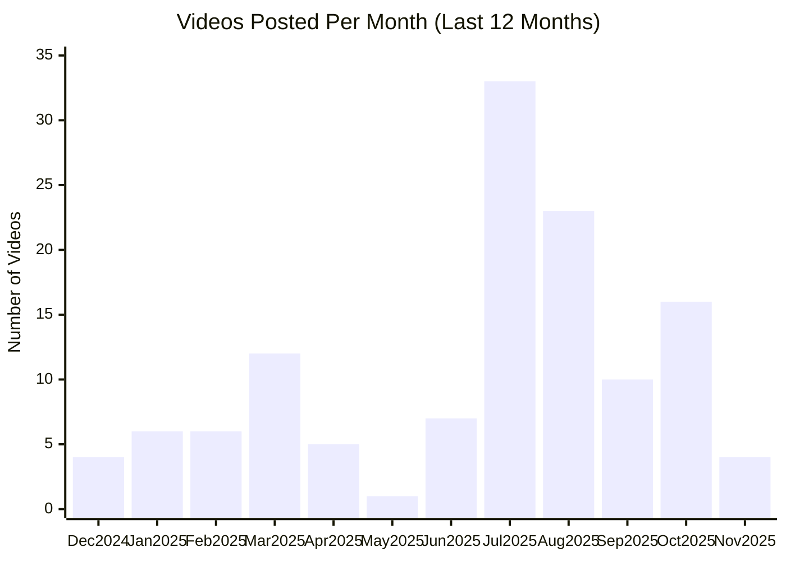

# Lovable YouTube Channel

## Overview

- **Subscribers**: 46,700
- **Total Videos**: 130
- **Long-form Videos**: 92
- **Shorts**: 60
- **Posts in Last 2 Months**: 25

---

## Posting Frequency Over Time

---

## Long-form Videos

| Title | Summary | Views | Posted Date |
|-------|---------|-------|-------------|
| [Lovable – An AI Full-Stack Engineer](https://www.youtube.com/watch?v=xhW9up0Gi2E) | Lovable – An AI Full-Stack Engineer. Lovable lets you take an idea of an app or website into reality just by prompting. | 4,323,530 | 11/21/2024 |
| [Journalist With Billion Dollar App Idea 🤑 #ai #tech #lovable #streetinterview #startup](https://www.youtube.com/watch?v=0UqCPWuwHb8) | Journalist With Billion Dollar App Idea 🤑 #ai #tech #lovable #streetinterview #startup. Journalist With Billion Dollar App Idea 🤑 #ai #tech #lovable #streetinterview #startup | 3,745,299 | 09/03/2025 |
| [Lovable 2.0 is here. Multiplayer vibe coding. Smarter & more secure.](https://www.youtube.com/watch?v=xDwR1_vrIg8) | Lovable 2.0 is here. Multiplayer vibe coding. Smarter & more secure.. Lovable lets build you apps and websites by chatting with AI. | 1,572,600 | 04/24/2025 |
| [How He Built A $1.2M Lovable Agency #ai #tech #appdevelopment](https://www.youtube.com/watch?v=D21XQK1luWs) | How He Built A $1.2M Lovable Agency #ai #tech #appdevelopment. How He Built A $1.2M Lovable Agency #ai #tech #appdevelopment | 472,439 | 09/19/2025 |
| [Introducing Lovable Cloud & AI](https://www.youtube.com/watch?v=kcOrTOT7Kko) | Introducing Lovable Cloud & AI. Anyone can now build apps with complex AI and backend functionality, just by prompting. | 402,854 | 09/29/2025 |
| [Introducing our Shopify Integration](https://www.youtube.com/watch?v=mF3VgbuoK8M) | Introducing our Shopify Integration. Now you can sell products online with lovable seamlessly and safely using our new Shopify integration. | 301,696 | 10/21/2025 |
| [He couldn't believe it 😂 #ai #lovable](https://www.youtube.com/watch?v=KIWvYTNYDYo) | He couldn't believe it 😂 #ai #lovable. 🚀 Try Lovable now: https://lovable.dev/?utm_source=youtube-organic&utm_campaign=streetinterview&utm_content=streetinterview | 295,165 | 10/25/2025 |
| [We 10x his business efficiency in 1min](https://www.youtube.com/watch?v=y2PQBhpvS9E) | We 10x his business efficiency in 1min. We 10x his business efficiency in 1min | 176,515 | 10/03/2025 |
| [Building a Luma Clone with Supabase & Lovable – LIVE Demo!](https://www.youtube.com/watch?v=-sSOyO0FiPE) | Building a Luma Clone with Supabase & Lovable – LIVE Demo!. 🚀 Can we build an event management platform in just 1 hour? Let’s find out! Join us for this hands-on session featuring @dshukertjr  from @Supabase , where we attempt to build a Luma-style event platform using Lovable and Supabase – live! | 136,921 | 03/06/2025 |
| [Build an AI-Powered Web App in 20 Minutes—No Code Required!](https://www.youtube.com/watch?v=gqsZGxuymTk) | Build an AI-Powered Web App in 20 Minutes—No Code Required!. 🚀 Build AI-powered web apps in just 20 minutes—NO coding required! In this tutorial, we’ll show you how to use Lovable, an AI-enhanced no-code builder, to create a full-stack journaling app without writing a single line of code! | 118,104 | 01/07/2025 |

*Top 10 videos by view count*

---

**Last Updated**: 11/16/2025
