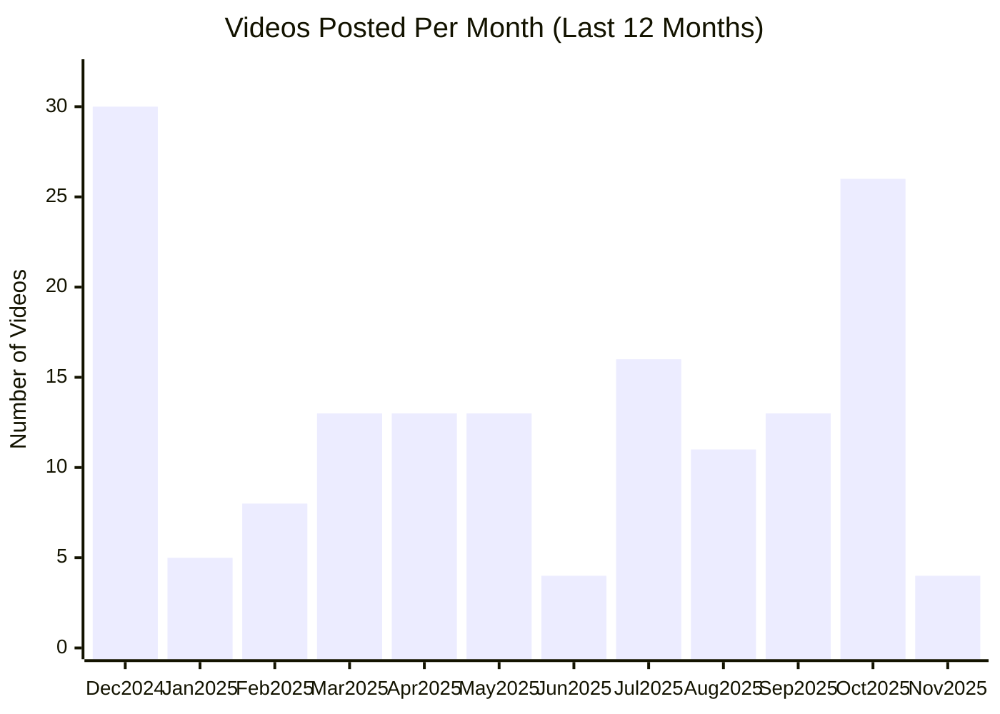

# OpenAI YouTube Channel

## Overview

- **Subscribers**: 1,890,000
- **Total Videos**: 407
- **Long-form Videos**: 233
- **Shorts**: 42
- **Posts in Last 2 Months**: 40

---

## Posting Frequency Over Time

---

## Long-form Videos

| Title | Summary | Views | Posted Date |
|-------|---------|-------|-------------|
| [Multi-Agent Hide and Seek](https://www.youtube.com/watch?v=kopoLzvh5jY) | Multi-Agent Hide and Seek. We’ve observed agents discovering progressively more complex tool use while playing a simple game of hide-and-seek. Through training in our new simulated hide-and-seek environment, agents build a series of six distinct strategies and counterstrategies, some of which we ... | 10,799,809 | 09/17/2019 |
| [Introducing GPT-4o](https://www.youtube.com/watch?v=DQacCB9tDaw) | Introducing GPT-4o. OpenAI Spring Update – streamed live on Monday, May 13, 2024. | 4,901,016 | 05/13/2024 |
| [Introducing Sora — OpenAI’s text-to-video model](https://www.youtube.com/watch?v=HK6y8DAPN_0) | Introducing Sora — OpenAI’s text-to-video model. Introducing Sora — OpenAI’s text-to-video model | 4,154,817 | 02/17/2024 |
| [GPT-4 Developer Livestream](https://www.youtube.com/watch?v=outcGtbnMuQ) | GPT-4 Developer Livestream. Join Greg Brockman, President and Co-Founder of OpenAI, at 1 pm PT for a developer demo showcasing GPT-4 and some of its capabilities/limitations. | 3,540,028 | 03/14/2023 |
| [Two GPT-4os interacting and singing](https://www.youtube.com/watch?v=MirzFk_DSiI) | Two GPT-4os interacting and singing. Say hello to GPT-4o, our new flagship model which can reason across audio, vision, and text in real time. | 3,077,275 | 05/13/2024 |
| [Introducing GPT-5](https://www.youtube.com/watch?v=0Uu_VJeVVfo) | Introducing GPT-5. Sam Altman, Greg Brockman, Sebastien Bubeck, Mark Chen, Yann Dubois, Brian Fioca, Adi Ganesh, Oliver Godement, Saachi Jain, Christina Kaplan, Christina Kim, Elaine Ya Le, Felipe Millon, Michelle Pokrass, Jakub Pachocki, Max Schwarzer, Rennie Song, Ruochen Wang introduce and dem... | 2,969,837 | 08/07/2025 |
| [OpenAI DevDay: Opening Keynote](https://www.youtube.com/watch?v=U9mJuUkhUzk) | OpenAI DevDay: Opening Keynote. Join us for the opening keynote from OpenAI DevDay — OpenAI’s first developer conference. | 2,688,158 | 11/06/2023 |
| [Math problems with GPT-4o](https://www.youtube.com/watch?v=_nSmkyDNulk) | Math problems with GPT-4o. Say hello to GPT-4o, our new flagship model which can reason across audio, vision, and text in real time. Featuring Sal and Imran Khan from  @khanacademy | 1,694,913 | 05/13/2024 |
| [Intro to Agent Builder](https://www.youtube.com/watch?v=44eFf-tRiSg) | Intro to Agent Builder. Christina Huang from OpenAI guides you through Agent Builder—a new visual tool to create agentic workflows. | 1,509,492 | 10/06/2025 |
| [Introduction to ChatGPT agent](https://www.youtube.com/watch?v=1jn_RpbPbEc) | Introduction to ChatGPT agent. Sam Altman, Casey Chu, Isa Fulford, Yash Kumar, and Zhiqing Sun introduce and demo our unified agentic model in ChatGPT. | 1,503,370 | 07/17/2025 |

*Top 10 videos by view count*

---

## Shorts

| Title | Summary | Views | Posted Date |
|-------|---------|-------|-------------|
| [Grocery list for pros.](https://www.youtube.com/watch?v=J2w1oeRg0tM) | Grocery list for pros.. Grocery list for pros. | 1,093,070 | 03/18/2024 |
| [This is Sora 2](https://www.youtube.com/watch?v=lEcg6AJ6DVY) | This is Sora 2. This is Sora 2, our most advanced video generation model yet that puts vivid, expressive creation into everyone’s hands. | 701,324 | 09/30/2025 |
| [What can you do with GPT-4?](https://www.youtube.com/watch?v=oc6RV5c1yd0) | What can you do with GPT-4?. GPT-4 is OpenAI’s most advanced system, producing safer and more useful responses. | 636,010 | 03/14/2023 |
| [Sarcasm with GPT-4o](https://www.youtube.com/watch?v=GiEsyOyk1m4) | Sarcasm with GPT-4o. Say hello to GPT-4o, our new flagship model which can reason across audio, vision, and text in real time. | 541,051 | 05/13/2024 |
| [Fast counting with GPT-4o](https://www.youtube.com/watch?v=G8sm27sGUu4) | Fast counting with GPT-4o. Say hello to GPT-4o, our new flagship model which can reason across audio, vision, and text in real time. | 513,984 | 05/13/2024 |
| [Dog meets GPT-4o](https://www.youtube.com/watch?v=HU_4vMu9xFI) | Dog meets GPT-4o. Say hello to GPT-4o, our new flagship model which can reason across audio, vision, and text in real time. | 419,180 | 05/13/2024 |
| [A Look at ChatGPT agent](https://www.youtube.com/watch?v=2wzGS_WUZYQ) | A Look at ChatGPT agent. ChatGPT can now do work for you using its own computer. | 298,627 | 07/17/2025 |
| [Meet ChatGPT's New Voice, Monday 🙄](https://www.youtube.com/watch?v=2uoF2w8-hKg) | Meet ChatGPT's New Voice, Monday 🙄. Meet ChatGPT's New Voice, Monday 🙄 | 251,759 | 04/01/2025 |
| [Echoes of Grace · Kaku Drop with Sora](https://www.youtube.com/watch?v=iVtqtu6HceI) | Echoes of Grace · Kaku Drop with Sora. Echoes of Grace · Kaku Drop with Sora | 232,331 | 11/20/2024 |
| [Dad jokes with GPT-4o](https://www.youtube.com/watch?v=dVwjogPWVws) | Dad jokes with GPT-4o. Say hello to GPT-4o, our new flagship model which can reason across audio, vision, and text in real time. | 230,485 | 05/13/2024 |
| [Happy Birthday with GPT-4o](https://www.youtube.com/watch?v=V6pYxfcDRks) | Happy Birthday with GPT-4o. Say hello to GPT-4o, our new flagship model which can reason across audio, vision, and text in real time. | 204,791 | 05/13/2024 |
| [How to Video Chat and Screenshare with ChatGPT #shorts](https://www.youtube.com/watch?v=kKVVw3ybVUA) | How to Video Chat and Screenshare with ChatGPT #shorts. It’s here. Video and screensharing are now starting to roll out in Advanced Voice in the ChatGPT mobile app. | 164,306 | 12/12/2024 |
| [Point and Learn Spanish with GPT-4o](https://www.youtube.com/watch?v=eurVrO2iFz0) | Point and Learn Spanish with GPT-4o. Say hello to GPT-4o, our new flagship model which can reason across audio, vision, and text in real time. | 160,419 | 05/13/2024 |
| [Niceaunties · Sora Showcase](https://www.youtube.com/watch?v=GSPN74NIHiM) | Niceaunties · Sora Showcase. Singaporean artist Niceaunties uses AI for “an art project about aging, beauty, freedom & fun, and an attempt to understand ‘auntie culture’” based in south-east and east Asia. Outside of this project, she is an architectural designer. | 117,071 | 09/09/2024 |
| [Dish with ChatGPT](https://www.youtube.com/watch?v=To04SSylvVY) | Dish with ChatGPT. Figure out what meal will impress…and learn how to make it with ChatGPT. | 94,295 | 09/28/2025 |
| [Pull-Up with ChatGPT](https://www.youtube.com/watch?v=IqC3YrIzbQw) | Pull-Up with ChatGPT. Pull-Up with ChatGPT | 84,462 | 09/28/2025 |
| [Work smarter with your company knowledge in ChatGPT](https://www.youtube.com/watch?v=DupfnOCH-JI) | Work smarter with your company knowledge in ChatGPT. Work smarter with your company knowledge in ChatGPT | 82,371 | 10/23/2025 |
| [Buy it in ChatGPT: Instant Checkout and the Agentic Commerce Protocol](https://www.youtube.com/watch?v=C6qcZdtIv54) | Buy it in ChatGPT: Instant Checkout and the Agentic Commerce Protocol. ChatGPT already helps millions of people find what to buy. Now it can help them buy it too. | 65,458 | 09/29/2025 |
| [5 More ChatGPT Prompts to Add to Your Collection](https://www.youtube.com/watch?v=iFHmvwvVCSg) | 5 More ChatGPT Prompts to Add to Your Collection. 5 More ChatGPT Prompts to Add to Your Collection | 63,485 | 07/21/2025 |
| [Space with ChatGPT](https://www.youtube.com/watch?v=9wxmlwRaZHc) | Space with ChatGPT. Find the perfect place and set up your study routine with ChatGPT. | 62,621 | 10/17/2025 |

*Top 20 shorts by view count*

---

**Last Updated**: 11/16/2025
