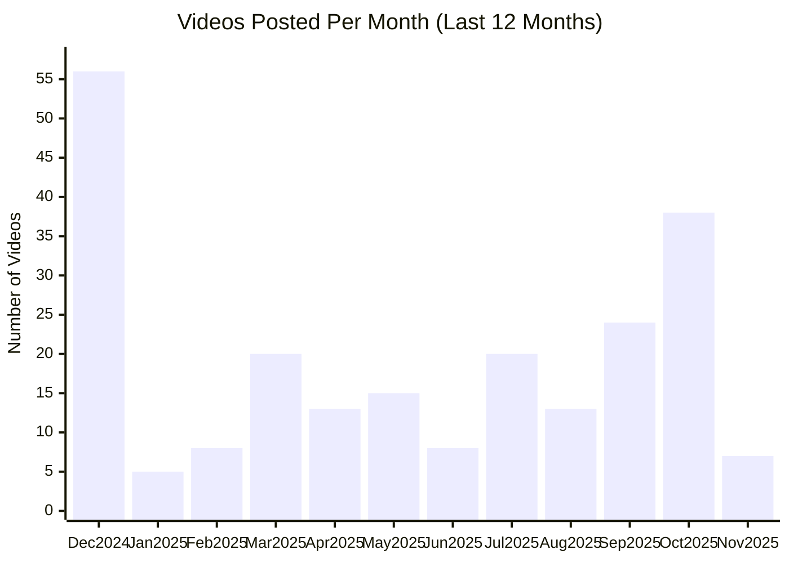

# OpenAI YouTube Channel

## Overview

- **Subscribers**: 1,890,000
- **Total Videos**: 407
- **Long-form Videos**: 319
- **Shorts**: 34
- **Posts in Last 2 Months**: 58

---

## Posting Frequency Over Time

---

## Long-form Videos

| Title | Summary | Views | Posted Date |
|-------|---------|-------|-------------|
| [Multi-Agent Hide and Seek](https://www.youtube.com/watch?v=kopoLzvh5jY) | Multi-Agent Hide and Seek. We’ve observed agents discovering progressively more complex tool use while playing a simple game of hide-and-seek. Through training in our new simulated hide-and-seek environment, agents build a series of six distinct strategies and counterstrategies, some of which we ... | 10,799,811 | 09/17/2019 |
| [Introducing GPT-4o](https://www.youtube.com/watch?v=DQacCB9tDaw) | Introducing GPT-4o. OpenAI Spring Update – streamed live on Monday, May 13, 2024. | 4,901,016 | 05/13/2024 |
| [Introducing Sora — OpenAI’s text-to-video model](https://www.youtube.com/watch?v=HK6y8DAPN_0) | Introducing Sora — OpenAI’s text-to-video model. Introducing Sora — OpenAI’s text-to-video model | 4,154,817 | 02/17/2024 |
| [GPT-4 Developer Livestream](https://www.youtube.com/watch?v=outcGtbnMuQ) | GPT-4 Developer Livestream. Join Greg Brockman, President and Co-Founder of OpenAI, at 1 pm PT for a developer demo showcasing GPT-4 and some of its capabilities/limitations. | 3,540,028 | 03/14/2023 |
| [Two GPT-4os interacting and singing](https://www.youtube.com/watch?v=MirzFk_DSiI) | Two GPT-4os interacting and singing. Say hello to GPT-4o, our new flagship model which can reason across audio, vision, and text in real time. | 3,077,275 | 05/13/2024 |
| [Introducing GPT-5](https://www.youtube.com/watch?v=0Uu_VJeVVfo) | Introducing GPT-5. Sam Altman, Greg Brockman, Sebastien Bubeck, Mark Chen, Yann Dubois, Brian Fioca, Adi Ganesh, Oliver Godement, Saachi Jain, Christina Kaplan, Christina Kim, Elaine Ya Le, Felipe Millon, Michelle Pokrass, Jakub Pachocki, Max Schwarzer, Rennie Song, Ruochen Wang introduce and dem... | 2,969,837 | 08/07/2025 |
| [OpenAI DevDay: Opening Keynote](https://www.youtube.com/watch?v=U9mJuUkhUzk) | OpenAI DevDay: Opening Keynote. Join us for the opening keynote from OpenAI DevDay — OpenAI’s first developer conference. | 2,688,158 | 11/06/2023 |
| [Math problems with GPT-4o](https://www.youtube.com/watch?v=_nSmkyDNulk) | Math problems with GPT-4o. Say hello to GPT-4o, our new flagship model which can reason across audio, vision, and text in real time. Featuring Sal and Imran Khan from  @khanacademy | 1,694,913 | 05/13/2024 |
| [Intro to Agent Builder](https://www.youtube.com/watch?v=44eFf-tRiSg) | Intro to Agent Builder. Christina Huang from OpenAI guides you through Agent Builder—a new visual tool to create agentic workflows. | 1,509,499 | 10/06/2025 |
| [Introduction to ChatGPT agent](https://www.youtube.com/watch?v=1jn_RpbPbEc) | Introduction to ChatGPT agent. Sam Altman, Casey Chu, Isa Fulford, Yash Kumar, and Zhiqing Sun introduce and demo our unified agentic model in ChatGPT. | 1,503,370 | 07/17/2025 |

*Top 10 videos by view count*

---

**Last Updated**: 11/16/2025
