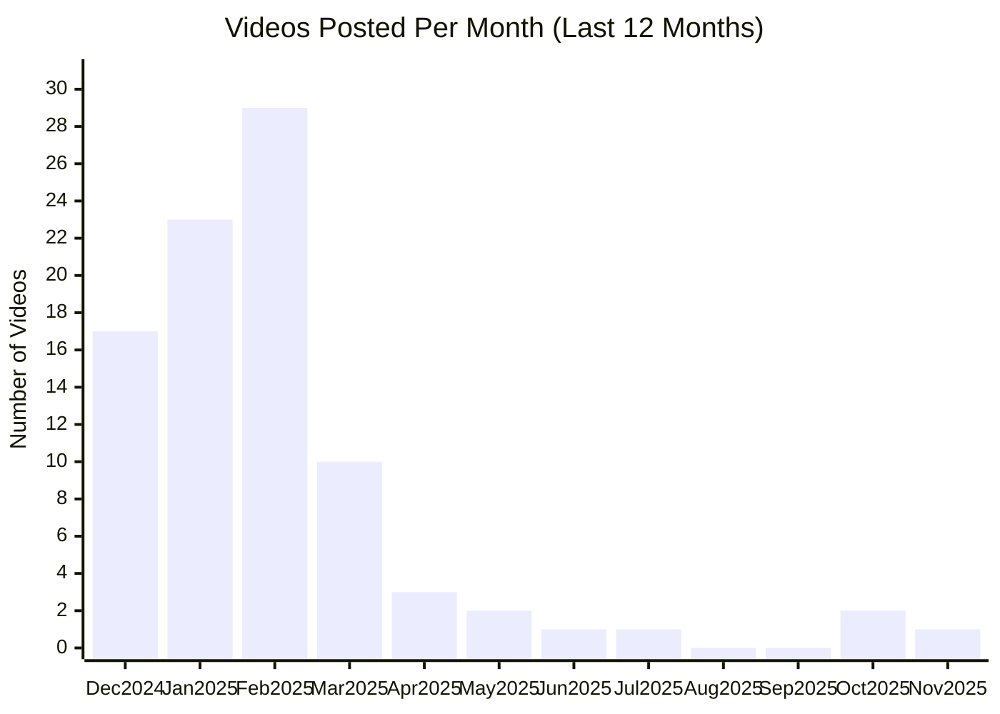

# Perplexity AI YouTube Channel

## Overview

- **Subscribers**: 47,700
- **Total Videos**: 353
- **Long-form Videos**: 290
- **Shorts**: 25
- **Posts in Last 2 Months**: 3

---

## Posting Frequency Over Time

---

## Long-form Videos

| Title | Summary | Views | Posted Date |
|-------|---------|-------|-------------|
| [Knowledge On-Demand](https://www.youtube.com/watch?v=3SKVMV2Gots) | Knowledge On-Demand. Perplexity—Where Knowledge Begins. The answers you need—right at your finger tips. | 4,909,990 | 09/28/2023 |
| [Perplexity Spaces](https://www.youtube.com/watch?v=ISw74fp-rqE) | Perplexity Spaces. We’ve also reinvented how teams research and organize information with Perplexity Spaces — AI-powered collaboration hubs that can be deeply customized to your specific use case. Whether you’re part of a project team conducting research, a sales team creating customer proposals,... | 3,274,697 | 10/17/2024 |
| [Perplexity Questions \| Starring Squid Game’s Lee Jung-jae](https://www.youtube.com/watch?v=4UKM_yvTexI) | Perplexity Questions \| Starring Squid Game’s Lee Jung-jae. When you need to get it right, ask Perplexity. http://www.Perplexity.ai | 2,787,868 | 03/17/2025 |
| [Perplexity Questions \| Starring Squid Game’s Lee Jung-jae](https://www.youtube.com/watch?v=t9TNbF-oJWk) | Perplexity Questions \| Starring Squid Game’s Lee Jung-jae. When you need to get it right, ask Perplexity. http://www.Perplexity.ai | 2,027,007 | 03/17/2025 |
| [Introducing Comet: Browse at the Speed of Thought](https://www.youtube.com/watch?v=YeldJ4UezDQ) | Introducing Comet: Browse at the Speed of Thought. Comet is a new web browser built for today’s internet—one that matches the way we live, work, and ask questions online. Forget the endless pile-up of tabs and fragmented workflows. | 216,461 | 07/09/2025 |
| ["The Garage" featuring Lewis Hamilton & Eric André](https://www.youtube.com/watch?v=sPp8DhuBsKA) | "The Garage" featuring Lewis Hamilton & Eric André. Perplexity helps you know it all, whether you’re a world champ fine tuning a high performance machine or… looking up soil content in South America to impress your neighbor. | 81,768 | 11/05/2025 |
| [What is Perplexity Copilot?](https://www.youtube.com/watch?v=ht3XV_nbduQ) | What is Perplexity Copilot?. You need answers, and you need them now. But sometimes, you need more than a quick Google search can offer. Enter Perplexity Copilot, your new search assistant for in-depth answers. | 49,551 | 10/17/2023 |
| [Perplexity Labs](https://www.youtube.com/watch?v=CDzfwDEgqkM) | Perplexity Labs. Perplexity Labs is for your more complex tasks. It is like having an entire team at your disposal. | 46,262 | 05/30/2025 |
| ["The Know-It-Alls" by Perplexity \| Official Trailer HD](https://www.youtube.com/watch?v=QfoulVr6UU8) | "The Know-It-Alls" by Perplexity \| Official Trailer HD. If all the world's knowledge were at our fingertips, could we push the boundaries of what's possible? We're about to find out. | 25,414 | 06/07/2024 |
| [Perplexity—This is where knowledge begins.](https://www.youtube.com/watch?v=hrggcbweDjc) | Perplexity—This is where knowledge begins.. Perplexity was founded on the belief that searching for information should be a straightforward, efficient experience, free from the influence of advertising-driven models. | 22,454 | 01/04/2024 |

*Top 10 videos by view count*

---

**Last Updated**: 11/16/2025
