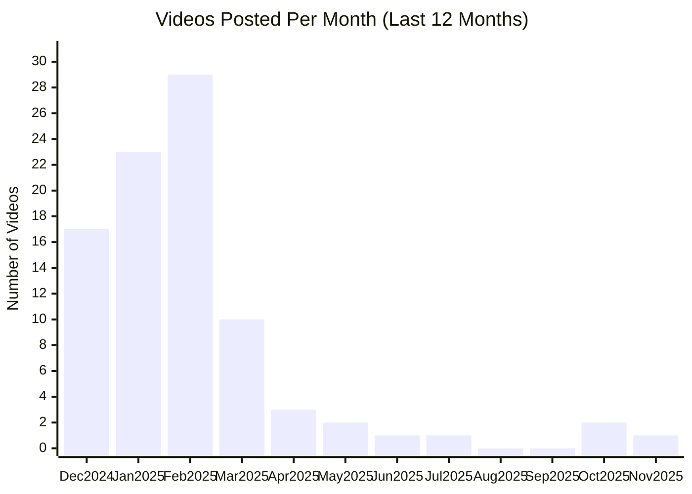

# Perplexity AI YouTube Channel

## Overview

- **Subscribers**: 47,700
- **Total Videos**: 353
- **Long-form Videos**: 290
- **Shorts**: 50
- **Posts in Last 2 Months**: 3

---

## Posting Frequency Over Time

---

## Long-form Videos

| Title | Summary | Views | Posted Date |
|-------|---------|-------|-------------|
| [Knowledge On-Demand](https://www.youtube.com/watch?v=3SKVMV2Gots) | Knowledge On-Demand. Perplexity—Where Knowledge Begins. The answers you need—right at your finger tips. | 4,909,990 | 09/28/2023 |
| [Perplexity Spaces](https://www.youtube.com/watch?v=ISw74fp-rqE) | Perplexity Spaces. We’ve also reinvented how teams research and organize information with Perplexity Spaces — AI-powered collaboration hubs that can be deeply customized to your specific use case. Whether you’re part of a project team conducting research, a sales team creating customer proposals,... | 3,274,697 | 10/17/2024 |
| [Perplexity Questions \| Starring Squid Game’s Lee Jung-jae](https://www.youtube.com/watch?v=4UKM_yvTexI) | Perplexity Questions \| Starring Squid Game’s Lee Jung-jae. When you need to get it right, ask Perplexity. http://www.Perplexity.ai | 2,787,868 | 03/17/2025 |
| [Perplexity Questions \| Starring Squid Game’s Lee Jung-jae](https://www.youtube.com/watch?v=t9TNbF-oJWk) | Perplexity Questions \| Starring Squid Game’s Lee Jung-jae. When you need to get it right, ask Perplexity. http://www.Perplexity.ai | 2,027,007 | 03/17/2025 |
| [Introducing Comet: Browse at the Speed of Thought](https://www.youtube.com/watch?v=YeldJ4UezDQ) | Introducing Comet: Browse at the Speed of Thought. Comet is a new web browser built for today’s internet—one that matches the way we live, work, and ask questions online. Forget the endless pile-up of tabs and fragmented workflows. | 216,461 | 07/09/2025 |
| ["The Garage" featuring Lewis Hamilton & Eric André](https://www.youtube.com/watch?v=sPp8DhuBsKA) | "The Garage" featuring Lewis Hamilton & Eric André. Perplexity helps you know it all, whether you’re a world champ fine tuning a high performance machine or… looking up soil content in South America to impress your neighbor. | 81,768 | 11/05/2025 |
| [What is Perplexity Copilot?](https://www.youtube.com/watch?v=ht3XV_nbduQ) | What is Perplexity Copilot?. You need answers, and you need them now. But sometimes, you need more than a quick Google search can offer. Enter Perplexity Copilot, your new search assistant for in-depth answers. | 49,551 | 10/17/2023 |
| [Perplexity Labs](https://www.youtube.com/watch?v=CDzfwDEgqkM) | Perplexity Labs. Perplexity Labs is for your more complex tasks. It is like having an entire team at your disposal. | 46,262 | 05/30/2025 |
| ["The Know-It-Alls" by Perplexity \| Official Trailer HD](https://www.youtube.com/watch?v=QfoulVr6UU8) | "The Know-It-Alls" by Perplexity \| Official Trailer HD. If all the world's knowledge were at our fingertips, could we push the boundaries of what's possible? We're about to find out. | 25,414 | 06/07/2024 |
| [Perplexity—This is where knowledge begins.](https://www.youtube.com/watch?v=hrggcbweDjc) | Perplexity—This is where knowledge begins.. Perplexity was founded on the belief that searching for information should be a straightforward, efficient experience, free from the influence of advertising-driven models. | 22,454 | 01/04/2024 |

*Top 10 videos by view count*

---

## Shorts

| Title | Summary | Views | Posted Date |
|-------|---------|-------|-------------|
| [Speak your mind with voice to voice on Perplexity.](https://www.youtube.com/watch?v=nogvDu91HZQ) | Speak your mind with voice to voice on Perplexity.. Ask any question — hear the answer. Available on iOS for Pro users. | 13,013,086 | 04/25/2024 |
| [Perplexity: A New Search Perspective](https://www.youtube.com/watch?v=9O_CfWQPHPk) | Perplexity: A New Search Perspective. Your quest for knowledge expands beyond text. Our latest update brings a new dimension to your search, seamlessly integrating images and videos to visually enhance every answer. | 4,744,668 | 11/17/2023 |
| [What is Perplexity Pages?](https://www.youtube.com/watch?v=KdpxyBKlSfs) | What is Perplexity Pages?. What is Perplexity Pages? | 4,140,905 | 08/12/2024 |
| ["The Know-It-Alls" by Perplexity \| Official Clip HD](https://www.youtube.com/watch?v=ZonHEwbjVOs) | "The Know-It-Alls" by Perplexity \| Official Clip HD. If all the world's knowledge were at our fingertips, could we push the boundaries of what's possible? We're about to find out. | 3,915,869 | 06/07/2024 |
| [Perplexity Questions \| Starring Squid Game’s Lee Jung-jae](https://www.youtube.com/watch?v=IdtJRNZT71s) | Perplexity Questions \| Starring Squid Game’s Lee Jung-jae. When you need to get it right, ask Perplexity. http://www.Perplexity.ai | 2,945,807 | 03/17/2025 |
| [Planning a date with Perplexity](https://www.youtube.com/watch?v=yG4d-nczAJA) | Planning a date with Perplexity. Planning a date with Perplexity | 2,794,128 | 07/23/2024 |
| [Pro Search: Upgraded for more advanced problem-solving](https://www.youtube.com/watch?v=5gSlVdHFvBk) | Pro Search: Upgraded for more advanced problem-solving. We're excited to announce significant upgrades to Pro Search. Already powered by advanced AI models like GPT-4 Omni and Claude 3.5 Sonnet, Pro Search now offers even more robust filtering out irrelevant information and delivers enhanced insi... | 1,780,254 | 07/01/2024 |
| [Introducing Interactive Knowledge Cards](https://www.youtube.com/watch?v=_Z8M7xF5k-8) | Introducing Interactive Knowledge Cards. We’re teaming up with Tako to bring advanced knowledge search and visualization to our users. Now, you can search, juxtapose, and share with authoritative knowledge cards in Perplexity. | 668,095 | 05/21/2024 |
| [Perplexity x Uber One Offer](https://www.youtube.com/watch?v=gwpu7h46370) | Perplexity x Uber One Offer. Knowledge drives us forward, and now it can travel with you. We’re excited to offer Uber One members across the US and Canada 1 free year of Perplexity Pro! Terms apply. | 220,058 | 08/01/2024 |
| [Introducing: Deep Research on Perplexity](https://www.youtube.com/watch?v=Z1_M2XtsUwY) | Introducing: Deep Research on Perplexity. Deep Research lets you generate in-depth research reports on any topic. | 158,455 | 02/14/2025 |
| [A new format for discovering stories on Perplexity, rolling out on iOS](https://www.youtube.com/watch?v=RLp5y5ljkRs) | A new format for discovering stories on Perplexity, rolling out on iOS. Spotted the changes? We'd love to hear your thoughts – your feedback is always appreciated! | 114,094 | 04/05/2024 |
| [Perplexity Questions Teaser \| Starring Squid Game’s Lee Jung-jae](https://www.youtube.com/watch?v=6qtibzgMD6o) | Perplexity Questions Teaser \| Starring Squid Game’s Lee Jung-jae. Perplexity Questions Teaser \| Starring Squid Game’s Lee Jung-jae | 28,363 | 03/14/2025 |
| [Introducing Perplexity Pages](https://www.youtube.com/watch?v=-qGa0oTY120) | Introducing Perplexity Pages. You’ve used Perplexity to search for answers, explore new topics, and expand your knowledge. Now, it’s time to share what you learned. | 21,424 | 05/30/2024 |
| [Perplexity x Lewis Hamilton](https://www.youtube.com/watch?v=qsq5CfIBtpU) | Perplexity x Lewis Hamilton. Today we’re announcing a global partnership between Perplexity and Lewis Hamilton - a collaboration that brings together the relentless pursuit of speed, precision, and curiosity. | 20,997 | 05/28/2025 |
| [Perplexity Finance SEC/EDGAR integration](https://www.youtube.com/watch?v=T_TONQ2L4bY) | Perplexity Finance SEC/EDGAR integration. Starting today, all Perplexity users have access to SEC data across Search, Research, and Labs. | 14,960 | 06/09/2025 |
| [Perplexity Assistant Camera Demo](https://www.youtube.com/watch?v=bPJBwNQd678) | Perplexity Assistant Camera Demo. Perplexity Assistant is multimodal, so you can tell it to turn on the camera and ask about what you see in front of you, or on your screen. http://www.Perplexity.ai | 11,819 | 02/18/2025 |
| [Perplexity Assistant Reservation Demo](https://www.youtube.com/watch?v=a3GjWf1luOI) | Perplexity Assistant Reservation Demo. Perplexity Assistant maintains context from one action to another — if you’re researching restaurants in your area and want to reserve a table, choose an option and Assistant will help book it. http://www.Perplexity.ai | 7,936 | 02/21/2025 |
| [Perplexity Assistant Reminder Demo](https://www.youtube.com/watch?v=zqT_31m4nZw) | Perplexity Assistant Reminder Demo. Perplexity Assistant browses the web to complete tasks for you. For example, if you want to be reminded of a public event, it will find the correct time and date and set an intelligent reminder. http://www.Perplexity.ai | 6,635 | 02/20/2025 |
| [Collections on Perplexity](https://www.youtube.com/watch?v=I1HPK92Ejxw) | Collections on Perplexity. We are incredibly excited to share our brand new feature with you that will significantly improve your threads experience, today, we're introducing Collections: | 5,838 | 09/16/2023 |
| [Summarize with Perplexity #ai #iphone #artificialintelligence #perplexity #nothingphone2  #android](https://www.youtube.com/watch?v=knWl6aMAcrs) | Summarize with Perplexity #ai #iphone #artificialintelligence #perplexity #nothingphone2  #android. There's always so much more to learn. Summarize, analyze, research, and so much more with Perplexity's latest Android app update. Download it on Google Playstore. | 5,781 | 10/19/2023 |

*Top 20 shorts by view count*

---

**Last Updated**: 11/16/2025
