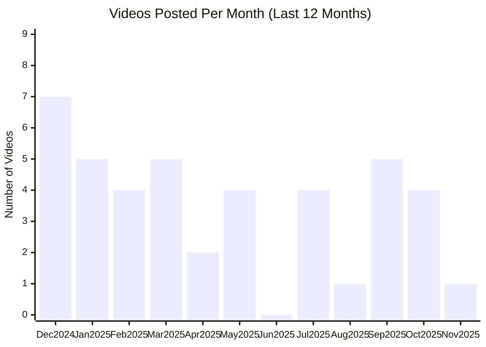

# Replit YouTube Channel

## Overview

- **Subscribers**: 93,700
- **Total Videos**: 245
- **Long-form Videos**: 57
- **Shorts**: 18
- **Posts in Last 2 Months**: 6

---

## Posting Frequency Over Time

---

## Long-form Videos

| Title | Summary | Views | Posted Date |
|-------|---------|-------|-------------|
| [Replit: Make an app for that](https://www.youtube.com/watch?v=4zd9hzngFwY) | Replit: Make an app for that. You've always wondered why that app didn't exist. Now you can make it. | 27,138,051 | 02/04/2025 |
| [Our newest integration: Notion](https://www.youtube.com/watch?v=ENYxveSU-pM) | Our newest integration: Notion. Our newest integration: Notion | 21,787,100 | 05/08/2025 |
| [Replit in 60 Seconds: everything you need to know](https://www.youtube.com/watch?v=gVPsrXy2Hg8) | Replit in 60 Seconds: everything you need to know. Learn how Replit lets you build and deploy apps using just natural language—no coding experience needed. | 5,909,515 | 07/01/2025 |
| [A doctor got quoted £100k for an app. He built it himself for £175.  #vibecoding #ai #agent](https://www.youtube.com/watch?v=QZ-cB0NhJkM) | A doctor got quoted £100k for an app. He built it himself for £175.  #vibecoding #ai #agent. Dr. Fahim Hussain, a practicing GP and partner at Northern Health, was launching "My Doctor"—an ambitious private healthcare venture offering telemedicine consultations, prescription services, and a compr... | 5,785,633 | 07/04/2025 |
| [Now Available: Replit Agent 3](https://www.youtube.com/watch?v=nr6qrQTv7QI) | Now Available: Replit Agent 3. Introducing Agent 3, our most autonomous Agent yet 🔥 | 5,272,278 | 09/10/2025 |
| [Replit: Make an app for that](https://www.youtube.com/watch?v=AE1w-6eJHh0) | Replit: Make an app for that. You've always wondered why that app didn't exist. Now you can make it. | 5,058,385 | 04/07/2025 |
| [How Greenleaf Built a Custom CRM, Saving Thousands of Dollars](https://www.youtube.com/watch?v=iLE2hziKZqQ) | How Greenleaf Built a Custom CRM, Saving Thousands of Dollars. Dave Codrea runs Greenleaf, a 60-person real estate investment company operating across 8 states. | 680,078 | 10/15/2025 |
| [From idea to app in minutes](https://www.youtube.com/watch?v=0NvnJFYTnCg) | From idea to app in minutes. From idea to app in minutes | 527,652 | 03/27/2025 |
| [What's the Replit Agent? Find out in 60 Seconds](https://www.youtube.com/watch?v=aWBiZc5XKJM) | What's the Replit Agent? Find out in 60 Seconds. 🚀 Replit Agent: From Idea to Software in 60 Seconds! | 459,774 | 09/12/2024 |
| [Replit for Anyone](https://www.youtube.com/watch?v=UGWGpzRPOh0) | Replit for Anyone. The next great developer could be you. With Replit, anyone can turn ideas into real applications—no coding experience needed. | 387,392 | 11/05/2025 |

*Top 10 videos by view count*

---

## Shorts

| Title | Summary | Views | Posted Date |
|-------|---------|-------|-------------|
| [Introducing Connectors](https://www.youtube.com/watch?v=FcSzZsEXDFk) | Introducing Connectors. Introducing Connectors—a new way to build apps and automations that integrate seamlessly with the tools you already use every day  🎉 | 8,884,336 | 09/30/2025 |
| [Now Available: Replit Agent v2](https://www.youtube.com/watch?v=1IQUY2QXpjg) | Now Available: Replit Agent v2. Idea to app, fast—meet the all-new Replit Agent 2.0 | 2,444,274 | 03/28/2025 |
| [Coding Python on mobile in 30 seconds #shorts](https://www.youtube.com/watch?v=5HK5NNTHQKA) | Coding Python on mobile in 30 seconds #shorts. Coding Python on mobile in 30 seconds #shorts | 146,576 | 11/01/2022 |
| [AI will replace 20% of SaaS within a year](https://www.youtube.com/watch?v=LWYQDMUai0E) | AI will replace 20% of SaaS within a year. AI will replace 20% of SaaS within a year | 127,420 | 04/10/2025 |
| [Learn Python in 30 Seconds \| Project-Based Full Course \| Make A Calculator](https://www.youtube.com/watch?v=MPdL-PrlTcI) | Learn Python in 30 Seconds \| Project-Based Full Course \| Make A Calculator. For more, I recommend: https://learnpythontherightway.com/ | 122,030 | 03/03/2022 |
| [Announcing: Replit Android + ChromeOS App](https://www.youtube.com/watch?v=gRFF9_LOlEw) | Announcing: Replit Android + ChromeOS App. Android and ChromeOS versions of Replit are now available! | 67,722 | 08/02/2021 |
| [Build & host a GPT-4 app in 30 seconds.](https://www.youtube.com/watch?v=NojGhaa1go0) | Build & host a GPT-4 app in 30 seconds.. If you have access to GPT-4, Replit is one of the fastest places to start building with it. | 57,675 | 03/15/2023 |
| [Learn to Make a Rickrolling Website with Python in 17 Seconds](https://www.youtube.com/watch?v=5gjKJUlF2x0) | Learn to Make a Rickrolling Website with Python in 17 Seconds. Learn to Make a Rickrolling Website with Python in 17 Seconds | 51,166 | 03/15/2022 |
| [Replit Deployments: The fastest way to go from idea to production](https://www.youtube.com/watch?v=PTie3KQhos8) | Replit Deployments: The fastest way to go from idea to production. How fast can you get from an idea to production? Watch this short to find out just what you can expect when you use Replit Deployments | 43,683 | 05/18/2023 |
| [Create your own code editor with AI](https://www.youtube.com/watch?v=uTw6btvvGNo) | Create your own code editor with AI. With “Make me an app”, you’ll be able to create software in seconds by simply talking to Replit on your phone. | 36,993 | 03/28/2023 |
| [Now you can create software using just your voice and AI](https://www.youtube.com/watch?v=YaLVKSjNzZM) | Now you can create software using just your voice and AI. With “Make me an app”, you’ll be able to create software in seconds by simply talking to Replit on your phone. | 31,265 | 03/24/2023 |
| [Agent & Assistant: Making the most of Replit's AI tools](https://www.youtube.com/watch?v=QiW2hXEphpI) | Agent & Assistant: Making the most of Replit's AI tools. Agent & Assistant: Making the most of Replit's AI tools | 26,066 | 12/10/2024 |
| [How to build a text adventure with Python! #shorts](https://www.youtube.com/watch?v=mHUTa-bNaQY) | How to build a text adventure with Python! #shorts. How to build a text adventure with Python! #shorts | 19,232 | 10/06/2022 |
| [Replit Teaser — September 10th Announcement](https://www.youtube.com/watch?v=VVuevxirxwc) | Replit Teaser — September 10th Announcement. We have been working hard on something exciting — designed to change the way you build 🤫 | 13,845 | 09/09/2025 |
| [How to Create Software with Your Voice](https://www.youtube.com/watch?v=EhWzbcYCO_Q) | How to Create Software with Your Voice. With “Make me an app”, you’ll be able to create software in seconds by simply talking to Replit on your phone. | 12,856 | 03/27/2023 |
| [How to create a dice-rolling program in Python! #shorts](https://www.youtube.com/watch?v=SoziWR-bNIk) | How to create a dice-rolling program in Python! #shorts. How to create a dice-rolling program in Python! #shorts | 10,208 | 10/13/2022 |
| [Introducing Bounties on Replit #shorts](https://www.youtube.com/watch?v=z73iGLTUh9U) | Introducing Bounties on Replit #shorts. Since 2016, Replit has helped millions to learn to code. | 7,078 | 12/16/2022 |
| [We all do it.  #shorts](https://www.youtube.com/watch?v=Qa9YUfwaIyI) | We all do it.  #shorts. We all do it.  #shorts | 6,209 | 10/28/2022 |

*Top 20 shorts by view count*

---

**Last Updated**: 11/16/2025
