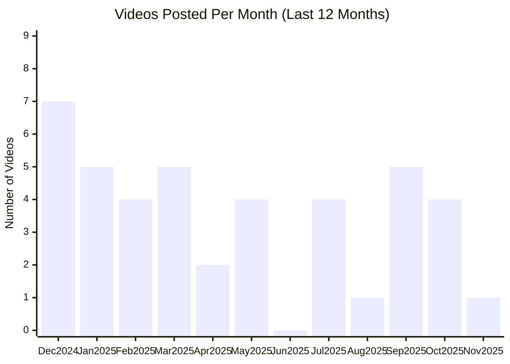

# Replit YouTube Channel

## Overview

- **Subscribers**: 93,700
- **Total Videos**: 245
- **Long-form Videos**: 57
- **Shorts**: 62
- **Posts in Last 2 Months**: 6

---

## Posting Frequency Over Time

---

## Long-form Videos

| Title | Summary | Views | Posted Date |
|-------|---------|-------|-------------|
| [Replit: Make an app for that](https://www.youtube.com/watch?v=4zd9hzngFwY) | Replit: Make an app for that. You've always wondered why that app didn't exist. Now you can make it. | 27,138,051 | 02/04/2025 |
| [Our newest integration: Notion](https://www.youtube.com/watch?v=ENYxveSU-pM) | Our newest integration: Notion. Our newest integration: Notion | 21,787,100 | 05/08/2025 |
| [Replit in 60 Seconds: everything you need to know](https://www.youtube.com/watch?v=gVPsrXy2Hg8) | Replit in 60 Seconds: everything you need to know. Learn how Replit lets you build and deploy apps using just natural language—no coding experience needed. | 5,909,515 | 07/01/2025 |
| [A doctor got quoted £100k for an app. He built it himself for £175.  #vibecoding #ai #agent](https://www.youtube.com/watch?v=QZ-cB0NhJkM) | A doctor got quoted £100k for an app. He built it himself for £175.  #vibecoding #ai #agent. Dr. Fahim Hussain, a practicing GP and partner at Northern Health, was launching "My Doctor"—an ambitious private healthcare venture offering telemedicine consultations, prescription services, and a compr... | 5,785,633 | 07/04/2025 |
| [Now Available: Replit Agent 3](https://www.youtube.com/watch?v=nr6qrQTv7QI) | Now Available: Replit Agent 3. Introducing Agent 3, our most autonomous Agent yet 🔥 | 5,272,278 | 09/10/2025 |
| [Replit: Make an app for that](https://www.youtube.com/watch?v=AE1w-6eJHh0) | Replit: Make an app for that. You've always wondered why that app didn't exist. Now you can make it. | 5,058,385 | 04/07/2025 |
| [How Greenleaf Built a Custom CRM, Saving Thousands of Dollars](https://www.youtube.com/watch?v=iLE2hziKZqQ) | How Greenleaf Built a Custom CRM, Saving Thousands of Dollars. Dave Codrea runs Greenleaf, a 60-person real estate investment company operating across 8 states. | 680,078 | 10/15/2025 |
| [From idea to app in minutes](https://www.youtube.com/watch?v=0NvnJFYTnCg) | From idea to app in minutes. From idea to app in minutes | 527,652 | 03/27/2025 |
| [What's the Replit Agent? Find out in 60 Seconds](https://www.youtube.com/watch?v=aWBiZc5XKJM) | What's the Replit Agent? Find out in 60 Seconds. 🚀 Replit Agent: From Idea to Software in 60 Seconds! | 459,774 | 09/12/2024 |
| [Replit for Anyone](https://www.youtube.com/watch?v=UGWGpzRPOh0) | Replit for Anyone. The next great developer could be you. With Replit, anyone can turn ideas into real applications—no coding experience needed. | 387,392 | 11/05/2025 |

*Top 10 videos by view count*

---

**Last Updated**: 11/16/2025
