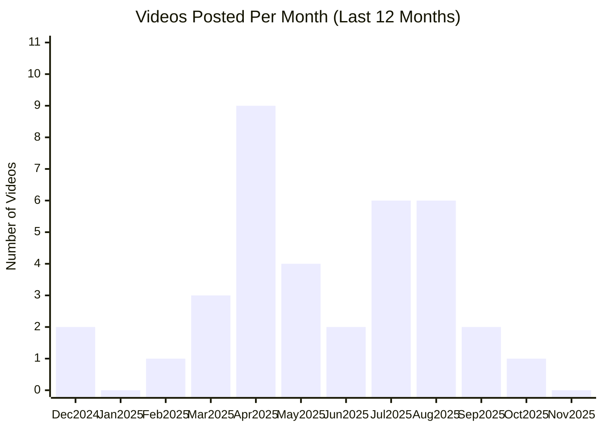

# RunwayML YouTube Channel

## Overview

- **Subscribers**: 121,000
- **Total Videos**: 86
- **Long-form Videos**: 67
- **Shorts**: 0
- **Posts in Last 2 Months**: 1

---

## Posting Frequency Over Time

---

## Long-form Videos

| Title | Summary | Views | Posted Date |
|-------|---------|-------|-------------|
| [Gen-3 Alpha: Available Now \| Runway](https://www.youtube.com/watch?v=nByslCkykj8) | Gen-3 Alpha: Available Now \| Runway. Gen-3 Alpha Text to Video is now available to everyone. A new frontier for high-fidelity, fast and controllable video generation. Try it now at https://runwayml.com | 1,107,005 | 07/01/2024 |
| [Gen-1: The Next Step Forward for Generative AI](https://www.youtube.com/watch?v=fTqgWkHiN0k) | Gen-1: The Next Step Forward for Generative AI. Use words and images to generate new videos out of existing ones. | 441,888 | 02/06/2023 |
| [Introducing Gen-2: Text to Video \| Runway](https://www.youtube.com/watch?v=trXPfpV5iRQ) | Introducing Gen-2: Text to Video \| Runway. Generate videos with nothing but words. If you can say it, now you can see it. Introducing, Text to Video. With Gen-2. Learn more at runwayml.com/research/gen-2. | 407,332 | 03/20/2023 |
| [Introducing Runway Gen-4 \| Runway](https://www.youtube.com/watch?v=uRkfzKYFOxc) | Introducing Runway Gen-4 \| Runway. Introducing Runway Gen-4: Our next-generation series of state of the art AI models for media generation and world consistency. | 295,539 | 03/31/2025 |
| [Getting Started with Gen-3 Alpha \| Runway Academy](https://www.youtube.com/watch?v=oYNzl4Hzi4M) | Getting Started with Gen-3 Alpha \| Runway Academy. Learn how to use Text to Video with Runway’s newest video model, Gen-3 Alpha. | 256,864 | 07/01/2024 |
| [Introducing Act-One \| Runway](https://www.youtube.com/watch?v=z3F0ei62Kmk) | Introducing Act-One \| Runway. Introducing, Act-One. A new way to generate expressive character performances inside Gen-3 Alpha using a single driving video and character image. No motion capture or rigging required. | 204,633 | 10/22/2024 |
| [Introducing Runway Aleph \| A new way to edit, transform and generate video.](https://www.youtube.com/watch?v=KUHx-2uz_qI) | Introducing Runway Aleph \| A new way to edit, transform and generate video.. Introducing Runway Aleph \| A new way to edit, transform and generate video. | 200,112 | 07/25/2025 |
| [Gen-2 Now Available \| Runway](https://www.youtube.com/watch?v=BpoOVEEDiFA) | Gen-2 Now Available \| Runway. If you can imagine it, you can generate it. Gen-2 is now available on web and iOS: | 180,734 | 06/07/2023 |
| [Image to Video with Gen-3 Alpha \| Runway Academy](https://www.youtube.com/watch?v=JkPO-mBV9bQ) | Image to Video with Gen-3 Alpha \| Runway Academy. Learn how to use Image to Video with Runway’s newest video model, Gen-3 Alpha. Try it now at runwayml.com | 144,212 | 07/30/2024 |
| [Introducing Act-Two \| Runway](https://www.youtube.com/watch?v=JW8PHlFD7HM) | Introducing Act-Two \| Runway. Introducing Act-Two, our next-generation motion capture model with major improvements in generation quality and support for head, face, body and hand tracking. Act-Two only requires a driving performance video and reference character. | 133,584 | 07/15/2025 |

*Top 10 videos by view count*

---

## Shorts

| Title | Summary | Views | Posted Date |
|-------|---------|-------|-------------|
| [Using 3D Assets with Gen-4 + References \| Runway](https://www.youtube.com/watch?v=Le-x_xkNe1c) | Using 3D Assets with Gen-4 + References \| Runway. Using 3D assets with Gen-4 References is a simple way to bring highly detailed and specific models into your generative workflows for even more consistency and control. | 50,993 | 05/05/2025 |
| [Using 3D Assets with Gen-4 + References \| Runway](https://www.youtube.com/watch?v=yYMpI3208ts) | Using 3D Assets with Gen-4 + References \| Runway. With Gen-4 References you can use 3D models to quickly position objects exactly where you want them. With just three images: a location, a 3D asset and a style reference, you can generate highly refined outputs without any rigging, texturing or re... | 45,994 | 05/06/2025 |
| [Introducing: Runway for Mobile](https://www.youtube.com/watch?v=At3kSthUM_k) | Introducing: Runway for Mobile. The magic of Gen-1. Now on your phone. Download the new Runway iOS app today: https://apple.co/41zhB5B | 33,153 | 04/24/2023 |
| [New Ways to Make the Impossible \| Runway](https://www.youtube.com/watch?v=6vK0S5C-wj8) | New Ways to Make the Impossible \| Runway. New year. New magic. New ways to Make the Impossible. What will you make in 2023? | 13,119 | 12/21/2022 |
| [AI Film Festival 2023 \| Runway](https://www.youtube.com/watch?v=sObLB1FWL9w) | AI Film Festival 2023 \| Runway. Introducing the first annual AI Film Festival. A celebration of the art and artists making the impossible at the forefront of AI filmmaking. Submissions open until January 15th, 2023. Learn more about AI Film Festival and submit your videos at runwayml.com/aiff | 10,140 | 12/07/2022 |
| [AI Film Festival 2024 \| Runway Studios](https://www.youtube.com/watch?v=tbuZXvNrXYM) | AI Film Festival 2024 \| Runway Studios. AI Film Festival 2024 \| Runway Studios | 8,142 | 09/07/2023 |
| [The 3rd Annual AI Film Festival: Submissions Open \| Runway](https://www.youtube.com/watch?v=5T9oMubPbcI) | The 3rd Annual AI Film Festival: Submissions Open \| Runway. The third annual international AI Film Festival returns this spring to New York and LA to celebrate artists at the forefront of technology and film. Submissions are now closed. | 5,511 | 10/15/2024 |
| [Introducing Creative Grants \| Runway Studios](https://www.youtube.com/watch?v=OBPi3KWy6ag) | Introducing Creative Grants \| Runway Studios. Introducing, Runway Studios Creative Grants. A new initiative designed to give filmmakers everywhere the production support they need to realize their creative vision with AI. | 5,229 | 02/23/2023 |

*Top 20 shorts by view count*

---

**Last Updated**: 11/16/2025
