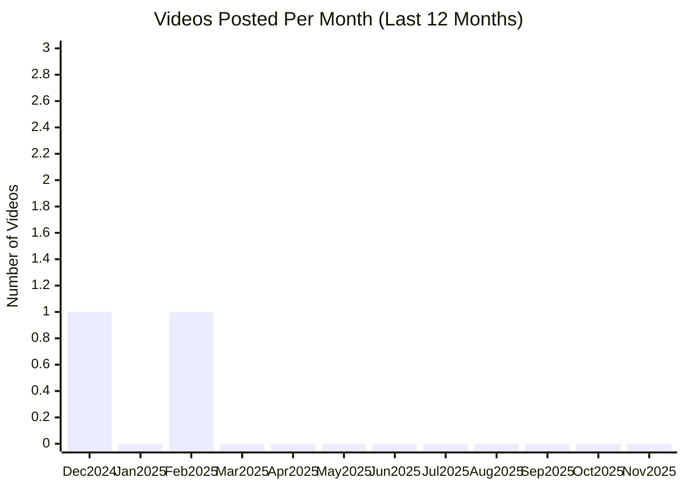

# Vercel YouTube Channel

## Overview

- **Subscribers**: 110,000
- **Total Videos**: 357
- **Long-form Videos**: 24
- **Shorts**: 0
- **Posts in Last 2 Months**: 0

---

## Posting Frequency Over Time

---

## Long-form Videos

| Title | Summary | Views | Posted Date |
|-------|---------|-------|-------------|
| [Next.js App Router: Routing, Data Fetching, Caching](https://www.youtube.com/watch?v=gSSsZReIFRk) | Next.js App Router: Routing, Data Fetching, Caching. @leerob, VP of Developer Experience at Vercel, explains new concepts and foundations of Next.js app router, including layouts, dynamic routes, and data fetching. Deploy today: https://vercel.fyi/app-router | 371,932 | 04/04/2023 |
| [10 common mistakes with the Next.js App Router](https://www.youtube.com/watch?v=RBM03RihZVs) | 10 common mistakes with the Next.js App Router. After talking to hundreds of developers and looking at thousands of Next.js repositories, I've noticed ten common mistakes when building with the Next.js App Router. | 275,768 | 01/08/2024 |
| [Loading UI with Next.js 13 and React Suspense](https://www.youtube.com/watch?v=2o5m1ovfl3c) | Loading UI with Next.js 13 and React Suspense. Next.js 13 introduced a new file convention, loading.js, to help you create meaningful Loading UI with React Suspense. Watch Sam Selikoff show a demo in three minutes. Try Vercel today: https://vercel.fyi/trypro | 221,239 | 01/18/2023 |
| [Build a fullstack app in 7 minutes with v0 (Figma to code)](https://www.youtube.com/watch?v=cyFVtaLy-bA) | Build a fullstack app in 7 minutes with v0 (Figma to code). v0 is a web development assistant that helps you build faster with AI. You can import and generate working applications from your Figma designs, iterate and improve, and finally deploy your new application to Vercel in a few clicks. | 220,773 | 12/17/2024 |
| [Theo Browne: Next.js is a backend framework](https://www.youtube.com/watch?v=W4UhNo3HAMw) | Theo Browne: Next.js is a backend framework. Tune in as Theo Browne, CEO at Ping.gg, discusses how the magic of Next.js is in the backend experience it provides to users. | 165,864 | 10/27/2022 |
| [Tru Narla: Building a design system in Next.js with Tailwind](https://www.youtube.com/watch?v=T-Zv73yZ_QI) | Tru Narla: Building a design system in Next.js with Tailwind. Learn how to set up a design system in a Next.js application, and how to build an accessible and easily customizable user interface with Tru Narla, Software Engineer at Discord. | 158,060 | 10/28/2022 |
| [Build anything with v0 (3D games, interactive apps)](https://www.youtube.com/watch?v=zA-eCGFBXjM) | Build anything with v0 (3D games, interactive apps). Build anything with v0 (3D games, interactive apps) | 156,624 | 08/28/2024 |
| [Next.js Conf Keynote: Introducing Next.js 13 and Turbopack](https://www.youtube.com/watch?v=NiknNI_0J48) | Next.js Conf Keynote: Introducing Next.js 13 and Turbopack. Watch the keynote from Next.js Conf 2022 live from San Francisco. | 148,809 | 10/25/2022 |
| [Deploying a backend on Vercel (APIs and Functions)](https://www.youtube.com/watch?v=yLMODEUPJdU) | Deploying a backend on Vercel (APIs and Functions). Learn how to deploy a backend to Vercel, like a REST API, through Vercel Functions. These backend APIs can then connect to your database or third-party services. | 123,999 | 01/23/2024 |
| [Why use a monorepo?](https://www.youtube.com/watch?v=flbz_5aMikw) | Why use a monorepo?. Matt Pocock (@mattpocockuk) explains how debugging is faster, code editing is easier, and build processes are easier to understand after refactoring a polyrepo setup to a monorepo, and deploying it on Vercel. Try Turborepo: https://vercel.fyi/tryturbo | 116,609 | 10/05/2022 |

*Top 10 videos by view count*

---

**Last Updated**: 11/16/2025
