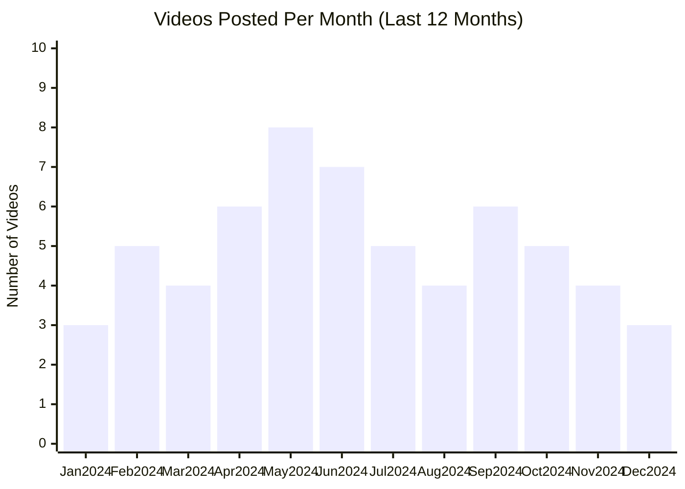

# Add AI Company YouTube Channel Research

This playbook walks you through adding research on an AI company's YouTube channel to the repo. Follow the steps in order to ensure consistency with existing conventions.

---

## 1. Collect Input

1. Get the company name (e.g., "Anthropic", "OpenAI", "Cursor").
2. Get the YouTube channel URL or channel ID.
3. Identify the company directory name (kebab case, e.g., `anthropic`, `openai`, `cursor`).

---

## 2. Create Directory Structure

1. Confirm the company directory exists at `ai-companies/{company-name}/`.  
   - If missing, create it (including intermediate folders).
2. Create or update the `youtube.md` file at `ai-companies/{company-name}/youtube.md`.

---

## 3. Set Up YouTube Data API

1. Ensure you have a YouTube Data API v3 key set in your environment:
   - Check for `YOUTUBE_API_KEY` environment variable or `.env` file.
   - If missing, get a key from: https://console.cloud.google.com/
   - Add it to `.env` file in the root directory: `YOUTUBE_API_KEY=your-actual-key-here`
   - Or set as environment variable: `export YOUTUBE_API_KEY='your-key-here'`

2. Install required Python packages (if not already installed):
   ```bash
   pip install -r instructions/scripts/requirements.txt
   ```

---

## 4. Run the Script

Use the provided script to automatically fetch channel data and generate the markdown file:

```bash
python instructions/scripts/generate_company_youtube.py <channel_id_or_url> <company_name> [company_dir]
```

**Arguments:**
- `channel_id_or_url`: YouTube channel ID (e.g., `UC...`) or channel URL (e.g., `https://youtube.com/@channelname`)
- `company_name`: Display name for the company (e.g., `"Anthropic"`, `"Open AI"`)
- `company_dir`: (Optional) Directory name in kebab-case (defaults to kebab-case of company_name)

**Examples:**
```bash
# Using channel ID
python instructions/scripts/generate_company_youtube.py UCchannelID123 Anthropic

# Using channel URL
python instructions/scripts/generate_company_youtube.py "https://youtube.com/@anthropic" Anthropic

# With custom directory name
python instructions/scripts/generate_company_youtube.py UCchannelID123 "Open AI" openai
```

The script will:
1. Fetch channel statistics (subscribers, total videos)
2. Retrieve all videos from the channel
3. Categorize videos into long-form (>60 seconds) and shorts (≤60 seconds)
4. Count recent posts (last 2 months)
5. Generate a Mermaid bar chart showing posting frequency per month for the last 12 months
6. Sort videos by view count
7. Generate summaries from video titles and descriptions
8. Create the markdown file at `ai-companies/{company-name}/youtube.md`

---

## 5. Verify the Generated Markdown File

The script creates `ai-companies/{company-name}/youtube.md` with the following structure:

### Markdown Template

````markdown
# {Company Name} YouTube Channel

## Overview

- **Subscribers**: {subscriber_count}
- **Total Videos**: {total_videos}
- **Long-form Videos**: {long_form_count}
- **Shorts**: {shorts_count}
- **Posts in Last 2 Months**: {recent_posts_count}

---

## Posting Frequency Over Time



*Bar chart showing the number of videos posted per month over the last 12 months*

---

## Long-form Videos

| Title | Summary | Views | Posted Date |
|-------|---------|-------|-------------|
| [{Video Title}](https://www.youtube.com/watch?v={VideoID}) | {2-3 sentence summary} | {view_count} | {MM/DD/YYYY} |
| ... | ... | ... | ... |

*Top 10 videos by view count*

---

## Shorts

| Title | Summary | Views | Posted Date |
|-------|---------|-------|-------------|
| [{Video Title}](https://www.youtube.com/watch?v={VideoID}) | {2-3 sentence summary} | {view_count} | {MM/DD/YYYY} |
| ... | ... | ... | ... |

*Top 20 shorts by view count*

---

**Last Updated**: {MM/DD/YYYY}
````

### Section Details

1. **Overview Section**:
   - Subscriber count (formatted with commas, e.g., "1,234,567")
   - Total number of videos
   - Total number of long-form videos (duration > 60 seconds)
   - Total number of shorts (duration ≤ 60 seconds)
   - Number of videos posted in the last 2 months

2. **Posting Frequency Over Time Section**:
   - Mermaid bar chart showing the number of videos posted per month for the last 12 months
   - Automatically generated from video publish dates
   - Displays all videos (both long-form and shorts) combined

3. **Long-form Videos Section**:
   - Table with top 10 videos sorted by view count (descending)
   - Columns: Title (hyperlink to YouTube), Summary (2-3 sentences), Views (formatted with commas), Posted Date (MM/DD/YYYY)
   - Include note: "*Top 10 videos by view count*"

4. **Shorts Section**:
   - Table with top 20 shorts sorted by view count (descending)
   - Columns: Title (hyperlink to YouTube), Summary (2-3 sentences), Views (formatted with commas), Posted Date (MM/DD/YYYY)
   - Include note: "*Top 20 shorts by view count*"

5. **Last Updated**:
   - Date when the data was collected (MM/DD/YYYY format)

---

## 6. Update README Table

After successfully generating the `youtube.md` file, update the main README table to include the new company:

1. Open `ai-companies/readme.md`
2. Locate the "YouTube Channels" table
3. Extract the following information from the newly created `youtube.md` file's Overview section:
   - **Subscribers**: The subscriber count (with commas)
   - **Total Videos**: Total number of videos
   - **Long-form Videos**: Number of long-form videos
   - **Shorts**: Number of shorts
   - **Posts in Last 2 Months**: Number of recent posts
4. Add a new row to the table with the company name and all the extracted statistics
5. Keep the table sorted alphabetically by company name

**Example:**
If you just added "Example Company" with 50,000 subscribers, 100 total videos, 80 long-form, 20 shorts, and 5 recent posts, add this row (in alphabetical order):

```markdown
| Example Company | 50,000 | 100 | 80 | 20 | 5 |
```

---

## 7. Verification Checklist

- [ ] Directory `ai-companies/{company-name}/` exists
- [ ] `youtube.md` file exists at the correct path
- [ ] Overview section includes all required metrics
- [ ] Posting frequency chart shows last 12 months with proper Mermaid syntax
- [ ] Long-form videos table has exactly 10 rows (or fewer if channel has less)
- [ ] Shorts table has exactly 20 rows (or fewer if channel has less)
- [ ] All video titles are hyperlinked to YouTube
- [ ] All summaries are 2-3 sentences
- [ ] View counts are formatted with commas
- [ ] Videos are sorted by view count (descending)
- [ ] Last updated date is included
- [ ] README table at `ai-companies/readme.md` has been updated with the new company's statistics
- [ ] Company row in README table is in alphabetical order

---

## 8. Commit Guidance

1. `git status` to review additions (expect `youtube.md` file and updated `readme.md`).
2. Commit message suggestion: `add {company-name} youtube channel research`.
3. Push or draft PR as usual.

---

## 9. Troubleshooting

### Script Errors

- **"YOUTUBE_API_KEY not set"**: Make sure you've set the API key in your environment or `.env` file in the root directory.
- **"Channel not found"**: Verify the channel ID or URL is correct. The script can handle channel IDs (UC...), channel URLs, or usernames.
- **"Quota exceeded"**: YouTube Data API has daily quotas. Wait until the quota resets or request an increase in Google Cloud Console.
- **"No videos found"**: The channel might be empty or private. Check the channel manually on YouTube.

### Manual Adjustments

If you need to manually edit the generated markdown:
- Video summaries are generated from titles and descriptions. You may want to improve them manually for better quality.
- If the script miscategorizes a video (short vs long-form), you can manually move it between sections.

---

## 10. FAQs

- **Q: How do I find a channel ID?**  
  A: You can find it in the channel URL (e.g., `youtube.com/channel/UC...`) or use the YouTube Data API to search by channel username/name.

- **Q: What if the channel has fewer than 10 long-form videos or 20 shorts?**  
  A: Include all available videos in the respective tables and note the actual count.

- **Q: How accurate are the summaries?**  
  A: The example script uses title + description. For better summaries, consider using an LLM/AI service to generate summaries from video descriptions or transcripts.

- **Q: The API quota is running out. What should I do?**  
  A: YouTube Data API has daily quotas. Consider caching results, using multiple API keys, or requesting a quota increase from Google Cloud Console.

- **Q: How do I distinguish shorts from regular videos?**  
  A: Check video duration (≤60 seconds) and look for "#shorts" or "#short" in the title/description. Some channels may not follow this convention exactly.

---

Following this script produces a comprehensive YouTube channel research file for AI companies. Use it whenever onboarding a new company's YouTube channel into the analysis repo.

